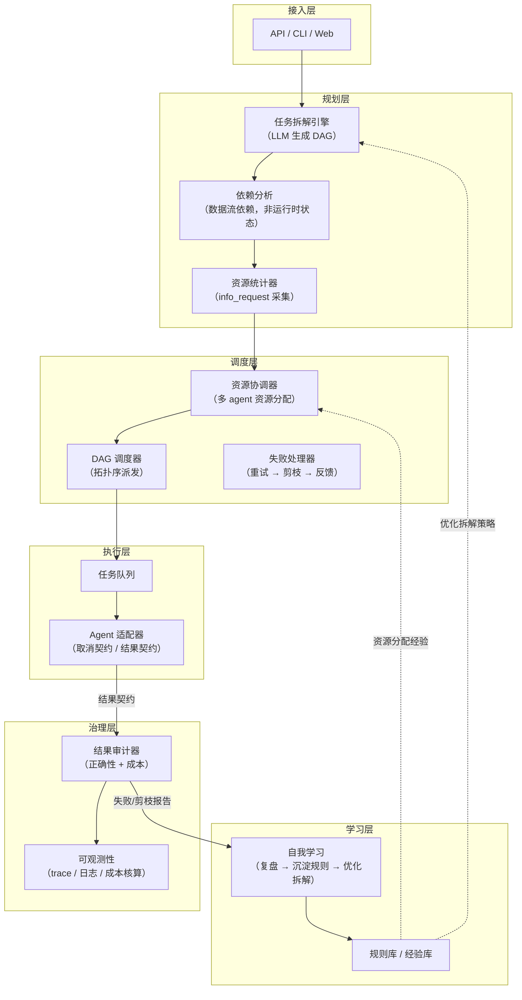
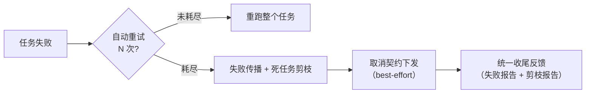

# Agents 编排框架 — 架构文档

> 版本：v1.0
> 日期：2026-08-15
> 状态：已实现（阶段一至四全部完成，151/151 测试全绿）

---

## 1. 背景与定位

### 1.1 一句话定义

**结果导向（Result-driven）的 Agent 编排框架**：框架负责"任务拆解 → 资源协调 → 调度分配 → 结果审计 → 自我学习"的完整闭环，**不关心 agent 执行过程与内部状态，只以结构化结果契约驱动一切**。

### 1.2 与主流框架的边界

| 维度 | LangGraph / CrewAI 等 | 本框架 |
|---|---|---|
| 编排形态 | 过程导向（状态机、断点、消息流转） | **结果导向（无状态批处理）** |
| 运行时状态 | 全程维护 | **不维护，过程交给 agent 自己** |
| 干预能力 | 可中途介入 | 一旦派发，只等结果（或取消） |
| 差异化能力 | 协作拓扑、记忆、工具链 | **资源统计、多 agent 资源协调、自我学习** |

> 编排的本质是"协调多个独立执行单元完成统一目标"，分为六环节：分解 → 规划 → 分配 → 调度 → 汇聚验证 → 反馈。本框架六个环节全覆盖，是编排的精炼形态（详见 §6 对比）。

---

## 2. 核心设计原则（已确认决策基线）

| # | 决策 | 说明 |
|---|---|---|
| D1 | **任务拆解 = 任务分解** | 合并为"任务拆解"，输出带依赖关系的 DAG |
| D2 | **结果导向，无状态** | 框架不管 agent 过程、不维护运行时状态、无 checkpoint / 断点续跑 |
| D3 | **失败处理分层** | 自动重试 N 次 → 耗尽后失败传播 + 死任务剪枝 → 统一反馈 |
| D4 | **工程要点** | ① 取消契约（best-effort，不影响"无状态"原则）② 竞态处理（先冻结派发再传播取消）③ 结果契约含副作用声明 |
| D5 | **提示词即协议** | 消息沟通格式 = 格式化提示词模板，随请求注入；agent 零适配，只接收两类请求（任务/信息）；格式演进只改模板，见 [messaging-protocol.md](./messaging-protocol.md) |

---

## 3. 总体架构

### 3.1 分层架构图



> 交互式架构总览图（HTML，专业排版）：[architecture-diagram.html](./architecture-diagram.html)

### 3.2 模块职责

| 模块 | 职责 | 关键输入 → 输出 |
|---|---|---|
| 任务拆解引擎 | LLM 将目标拆解为子任务 + 依赖 DAG | 目标 → `DAG{Task[]}` |
| 资源统计器 | info_request 采集 agent 能力 / 资源 / 约束声明（阶段三 `AgentRegistry`） | agent 池 → `AgentProfile[]` |
| 依赖分析 | 标注数据流依赖（A 的结果是 B 的输入） | `DAG` → `DependencyGraph` |
| 资源协调器 | 在多个可用 agent / 模型间分配资源，防超配 | `ResourcePlan` + agent 池 → `Allocation` |
| DAG 调度器 | 按拓扑序派发任务，传递结果，管理取消 | `Allocation` + 结果流 → 派发/取消指令 |
| 失败处理器 | 重试 → 失败传播 → 死任务剪枝 → 统一反馈 | 失败事件 → 剪枝集合 + 取消报告 |
| Agent 适配器 | 对接任意 agent（DeepSeek / Claude / 自建，默认 OpenAI 兼容 HTTP 端点，见 §3.3）：装配协议提示词（模板 + 请求 JSON）+ 解析响应，实现取消契约与结果契约 | 任务 → 提示词请求 → `Result` |
| 结果审计器 | 校验正确性、核算成本、标记异常 | `Result[]` → `AuditReport` |
| 自我学习 | 复盘失败与低效拆解，沉淀规则优化拆解策略 | `AuditReport` / 剪枝报告 → 规则 |

### 3.3 Agent 接入方式（默认 HTTP，OpenAI 兼容端点）

- **默认形态**：agent 作为 HTTP 服务暴露 **OpenAI 兼容的 chat completions 端点**（事实标准——OpenAI / DeepSeek / vLLM / Ollama / 自建 agent 均可导出）。框架是客户端，agent 是服务端；"框架永远主动"（协议 §1 P1）。
- **零成本接入**：兼容端点 = 注册表一条配置即接入，框架零代码：

  ```python
  from orchestration.adapters.deepseek import DeepSeekAdapter

  registry.register(
      DeepSeekAdapter(                        # OpenAI 兼容适配器：改 base_url 即对接任意端点
          model="deepseek-chat",              # 兼容端点的模型名
          base_url="https://customer.internal/v1",  # 客户 agent 的兼容端点
          api_key="...",                      # 缺省读 $DEEPSEEK_API_KEY
          template_mode="full",               # 低能力模型可 "simple"（协议 §7.8）
      ),
      agent_id="customer_agent_1",
  )
  ```

- **不兼容的自建系统**才需要写 adapter：实现 `_call_llm` 一个方法（约 20 行），协议装配 / 双层校验 / 解析重试 / 成本回填全部由基类复用——这是扩展点，不是常态。
- **协议与传输解耦**：协议内容（模板 + 请求 JSON，[messaging-protocol.md](./messaging-protocol.md)）对所有 agent 相同；adapter 只负责"怎么送"。默认 OpenAI 兼容 HTTP；未来 gRPC / 消息队列 / 本地进程只需新增 adapter，模板与请求 JSON 不变。
- **方向区分**：上行（使用方 → 框架）走 API 网关（框架作服务端）；下行（框架 → agent）走 adapter（框架作客户端）。两条链路均为 HTTP 但角色相反，各管一段、互不混淆。

---

## 4. 数据模型

### 4.1 任务模型 Task

```json
{
  "id": "task_001",
  "parent_id": null,
  "deps": ["task_000"],
  "desc": "拆解后的子任务描述",
  "required_resources": {"model": "deepseek-chat", "budget": 1.2, "timeout": 300},
  "required_capabilities": ["代码审查", "数据分析"],
  "status": "pending | running | success | failed | cancelled | skipped",
  "side_effects": "none | external_api | file_write"
}
```

> `required_capabilities`：任务的能力需求标签（拆解层声明，阶段三起按能力匹配 agent，见 `AgentRegistry`）；为空时只按 `required_resources.model` 匹配。

### 4.2 结果契约 Result（框架一切逻辑的枢纽）

```json
{
  "request_id": "req_0001",
  "task_id": "task_001",
  "success": true,
  "output": { },
  "error": null,
  "usage": {"tokens_in": 1200, "tokens_out": 800, "cost": 0.42},
  "duration_ms": 12345,
  "retries": 2,
  "side_effect_report": "已提交外部订单 #A88"
}
```

> `request_id` / `task_id` 用于对账（消息协议 §7.7 强制回带）；简化版模板下可缺失，框架补值、对账降级。
> 审计、资源协调、自我学习全部依赖此契约；**无契约，框架断链**。

### 4.3 DAG 模型

- 节点 = 任务，边 = **数据流依赖**（不是运行时状态）
- 调度器只认拓扑序：`in-degree = 0` 的可派发
- 失败传播、死任务剪枝均在 DAG 上做图算法（见 §5）

### 4.4 消息沟通协议

框架与 agent 之间**唯一的**沟通方式：**提示词即协议**——格式化提示词模板随请求注入，agent 零适配、只接收两类请求（任务请求 `task_request` / 信息请求 `info_request`），格式与内容演进只改模板文本。详见 [messaging-protocol.md](./messaging-protocol.md)。

---

## 5. 失败处理：失败传播 + 死任务剪枝

### 5.1 分层策略



### 5.2 反向可达性剪枝算法

```
任务 T 失败（重试耗尽）：
  1. 取消 T 的全部后代（输入链断裂）
  2. 若全部最终交付任务 final task 均被取消（存活 final 为空）
       → 整棵 DAG 取消，流程终止
  3. 否则：
     以所有仍存活的 final task 为根，反向遍历依赖图
       → 可达的任务保留
       → 不可达的任务全部取消
       判据："我的产出还有没有人要？"没人要 = 继续无意义 = 停
```

- 多 final 语义：final 集合可含多个交付点；只要存在存活 final，其他分支已成功的任务保留（独立交付分支不被误杀）。统一规则 = 反向可达公式：存活 final 为空即空集，等价于整棵取消。

- 该判据自动覆盖"与 T 并行、但最终需汇合"的任务——汇合点消失后，反向遍历不可达，一并剪除。
- 剪枝是**调度层动作**（撤销后续派发），不侵入 agent 内部，不违背 D2。

### 5.3 竞态处理（取消传播有延迟）

```
1. 冻结新派发（暂停 in-degree=0 任务的派发）
2. 逐级下发取消信号（best-effort）
3. 统一收尾：晚到的结果直接丢弃；按取消报告收账
```

### 5.4 取消报告（同时喂给审计与学习）

```json
{
  "root_failure": {"task_id": "task_002", "reason": "model_timeout", "retries": 3},
  "pruned": [
    {"task_id": "task_007", "state_at_cancel": "running",  "prune_reason": "downstream_chain"},
    {"task_id": "task_008", "state_at_cancel": "pending",  "prune_reason": "unreachable_from_final"}
  ],
  "pruned_final": false
}
```

- 审计：剪枝任务计入成本核算（已发生的消耗不算浪费账目）
- 学习：复盘"为什么这次拆解产生了无意义并行任务" → 沉淀拆解优化规则

---

## 6. 编排定位对照

| 编排环节 | 本框架对应模块 | 说明 |
|---|---|---|
| 分解 decompose | 任务拆解引擎 | DAG 动态生成 |
| 规划 plan | 依赖分析 | 数据流依赖 |
| 分配 allocate | 资源统计 + 资源协调 | 差异化点 |
| 调度 schedule | DAG 调度器 | 拓扑序 + 取消 |
| 汇聚验证 verify | 结果审计 | 正确性 + 成本 |
| 反馈 feedback | 自我学习 | 差异化点 |

> vs 工作流：静态固定流程 ≠ 本框架（LLM 动态生成 DAG）→ 是编排
> vs 编制（Choreography）：去中心化自主协作 ≠ 本框架（中心化统一调度）→ 是编排
> vs 过程编排：本框架为结果导向形态 → 是编排的精炼子集

---

## 7. 关键技术决策

| # | 决策 | 理由 |
|---|---|---|
| T1 | 结果导向，无状态 | LLM 结果导向，框架不背过程复杂度 |
| T2 | 数据流依赖而非运行时状态 | 唯一必须保留的"依赖"是输入产出关系 |
| T3 | 失败先重试后剪枝 | 偶发失败（超时）砍整棵子树成本更高 |
| T4 | 取消 = 调度层动作 | 不侵入 agent，保持无状态原则 |
| T5 | 副作用声明进结果契约 | 防止剪枝/审计对副作用误判 |

---

## 8. 后续 Roadmap

编号口径：阶段二=治理与学习、阶段三=资源统计与任务分配、阶段四=并发执行模型。
**实现顺序为 三 → 二 → 四**：并发模型（四）依赖资源统计（三）提供并发度上限，避免盲目并发打爆限流；审计数据面（二）在任务分配（三）落地后建模，可直接按"多 agent 归属"一步到位，避免返工。

- [x] **阶段一：核心闭环**（2026-08-14 完成）— 任务拆解（DAG）+ DAG 调度器 + 结果契约 + Agent 适配器（DeepSeek）+ 失败处理（重试 N=2 指数退避 / 失败传播 / 死任务剪枝 / 取消契约，见 T3/T4）— 解析层与剪枝 50/50 测试全绿，见 §10
- [x] **阶段三：资源统计与任务分配**（2026-08-15 完成）— 能力注册表 + info_request 采集 + 多 agent 资源协调 + 任务分配 — 实现：`AgentRegistry`（orchestration/registry.py），能力/资源/约束经 info_request 采集解析入库（可刷新，单点失败隔离）；分配三级策略全程留痕（`Assignment`：exact 精确 model 匹配（同 model 多实例轮询）→ capability 能力匹配（部分覆盖标记 risk）→ degraded 降级默认通用 LLM（显式留痕，默认不可用回退任意可用 agent）；连续任务失败达到阈值自动摘除（best-effort）；`Task.required_capabilities` 由拆解层声明。测试 76/76 全绿，见 §10
- [x] **阶段二：治理与学习**（2026-08-15 完成）— 审计器 + 成本核算 + 自我学习规则提取 — 实现：`Auditor`（orchestration/audit.py）——正确性对账（状态 vs 结果契约矛盾/缺失契约/晚到结果）、分配审计（降级/风险留痕消费）、剪枝审计（§5.4 取消报告归集）、语义交叉校验（§7.5 副作用声明 vs 报告）、错误模式归集，verdict 三级判定（ok/warning/critical）；`CostAccountant`（orchestration/cost.py）——按 agent/匹配类型归集成本与 token、失败成本与剪枝已发生消耗单独暴露（§5.4 口径）、预算超支判定（声明 0 不判）；`LearningEngine`（orchestration/learning.py）——启发式规则提取（REC/FP/DEG/CAP/BUG/PRU 六类，阈值可配，证据+动作建议），供拆解优化闭环消费。测试 115/115 全绿，见 §10
- [x] **阶段四：并发执行模型**（2026-08-15 完成，依赖阶段三）— asyncio 并发调度 + 多模型接入 + 可观测性 + API 网关 — 实现：
  - `AsyncScheduler`（orchestration/scheduler_async.py）——事件驱动并发派发（FIRST_COMPLETED 持续推进）；**资源限制执行**（阶段三从统计走向执行）：per-agent 并发上限（Semaphore，max_concurrency）+ 滑动窗口限速（rate_limit_per_min，0=不限）；**竞态处理**（§5.3）：失败 → 冻结新派发 → 剪枝 → 对 RUNNING 任务逐级下发取消（best-effort）→ 等待全部 in-flight 收尾 → 解冻；**晚到结果直接丢弃**（不写 task.result、不计健康度、不计成本）；执行期间被剪枝立即停止重试（不烧钱）；外部取消（cancel_event → 整棵取消，final_status=cancelled，已完成任务不回收）；**多 run 并发隔离**（_RunCtx：运行状态全在 per-run 上下文，同一实例可并发跑多个 DAG）
  - adapter 异步化（adapters/base.py）——`arun_task/arun_info/acancel` 异步路径，默认 `_acall_llm` 线程化（asyncio.to_thread），只有同步实现的 adapter 零改动即可被并发调度；`DeepSeekAdapter` override `_acall_llm` 用 AsyncOpenAI 真异步；解析重试异步版 `aparse_result`（validation.py）；**真实元数据回填**（冒烟实测修正）：真实 LLM 不自报 usage，`_post_process` 钩子（contextvars 协程隔离）从 API 响应捕获 token/耗时回填 Result，DeepSeek 单价表在适配器内维护
  - 可观测性（orchestration/metrics.py）——`MetricsCollector` 指标聚合（按 run_id 隔离：任务/成功/失败/取消/剪枝/成本/耗时/agent 成功率/峰值并发/降级数）+ 结构化日志（key=value formatter）
  - API 网关（orchestration/api/gateway.py）——FastAPI REST：`POST /api/runs` 提交 DAG（后台执行）、`GET /api/runs/{id}` 进度快照、`GET /api/runs/{id}/report` 收尾报告（含审计数据源）、`GET /api/runs/{id}/metrics`、`POST /api/runs/{id}/cancel`、`GET /api/agents`；`RunManager` 管理 run 生命周期（编程式 `submit/wait/report/cancel`）
  - `ScheduleReport` 上移至 models.py——同步/异步调度器共用同一契约，阶段二审计/成本/学习直接消费（已冒烟验证：AsyncScheduler 报告 → Auditor/CostAccountant/LearningEngine 全链路）
  - 测试 151/151 全绿，见 §10

---

## 9. 待定项（实现前需拍板）

1. ~~技术栈~~ —— 已定 **Python**（2026-08-14），见 §10
2. ~~重试参数默认值~~ —— 已定：N=2、指数退避（阶段一调度器已实现）
3. ~~拆解引擎模型与结构化输出格式（JSON Schema）~~ —— 已定：拆解 Schema 已实现（decomposer.py，LLM 生成 DAG + Schema 校验）
4. ~~多 agent 资源池的"资源"维度定义（模型并发 / 预算 / 速率配额）~~ —— 已定：max_concurrency（并发上限）/ rate_limit_per_min（速率配额）/ budget_limit_usd（预算），阶段三落地，阶段四起由 AsyncScheduler 强制执行（Semaphore + 滑动窗口）

## 10. 技术栈与工程基线（2026-08-14 定）

| 项 | 选择 | 说明 |
|---|---|---|
| 语言 | Python >= 3.10 | 生态成熟，LLM 适配层首选 |
| 包管理 | pyproject.toml（setuptools） | 标准现代工程布局 |
| 数据模型 | pydantic v2 | 结果契约 / 任务模型的唯一事实来源 |
| LLM 客户端 | openai SDK | 默认对接 **OpenAI 兼容 chat completions 端点**（事实标准）。DeepSeek 适配器即该形态（base_url 指向 api.deepseek.com）；客户 agent 暴露兼容端点后，注册表配置 `base_url + api_key + model` 即零成本接入（§3.3） |
| 并发模型 | asyncio（阶段四） | 事件驱动并发调度；adapter 默认线程化兼容同步实现 |
| API 网关 | FastAPI + uvicorn（阶段四） | REST 入口：提交 / 查询 / 报告 / 取消 / 指标 |
| 解析层 | 手写校验器（不引 jsonschema） | 结果契约字段固定，手写更严格、错误信息可直接用于修正提示 |
| 测试 | pytest | 解析层与调度器优先覆盖 |

### 10.1 目录结构

```
agentsOrchestration/
├── pyproject.toml
├── docs/
│   ├── architecture.md
│   ├── messaging-protocol.md
│   └── architecture-diagram.html
├── scripts/
│   └── smoke_deepseek.py       # 真实 DeepSeek 端到端冒烟（README 有运行说明）
├── orchestration/           # 主包
│   ├── models.py            # Task / Result / Assignment / DAG（含图算法）/ ScheduleReport
│   ├── protocol.py          # PROTOCOL_PROMPT 模板（完整/简化版）+ 请求构造 + 渲染
│   ├── validation.py        # 双层校验：提取 → Schema 校验 → 解析重试（同步/异步）
│   ├── decomposer.py        # 任务拆解：LLM 生成 DAG + 拆解 Schema 校验
│   ├── registry.py          # Agent 注册表：采集 / 分配 / 摘除（阶段三）
│   ├── scheduler.py         # 同步调度器：拓扑派发 + 任务分配 + 失败传播 + 剪枝
│   ├── scheduler_async.py   # 异步并发调度器：并发派发 + 竞态处理 + 资源限制（阶段四）
│   ├── metrics.py           # 可观测性：指标聚合 + 结构化日志（阶段四）
│   ├── audit.py             # 结果审计器：对账 / 分配审计 / 剪枝审计 / 交叉校验（阶段二）
│   ├── cost.py              # 成本核算：按 agent/匹配类型归集 + 预算判定（阶段二）
│   ├── learning.py          # 自我学习：规则提取（失败模式/降级/风险/预算/剪枝）（阶段二）
│   ├── api/
│   │   └── gateway.py       # API 网关：RunManager + FastAPI 端点（阶段四）
│   └── adapters/
│       ├── base.py          # AgentAdapter 抽象基类（同步 + 异步双路径）
│       └── deepseek.py     # DeepSeek 适配器（AsyncOpenAI 真异步，key 读 $DEEPSEEK_API_KEY）
└── tests/
    ├── helpers.py             # 测试共享：异步脚本适配器 + 快速构造（阶段四）
    ├── test_validation.py
    ├── test_scheduler.py
    ├── test_scheduler_async.py # 并发调度 / 竞态 / 资源限制（阶段四）
    ├── test_registry.py
    ├── test_protocol.py
    ├── test_audit.py          # 审计器（阶段二）
    ├── test_cost.py           # 成本核算（阶段二）
    ├── test_learning.py       # 自我学习规则（阶段二）
    ├── test_metrics.py        # 指标收集 + 结构化日志（阶段四）
    └── test_gateway.py        # API 网关（阶段四）
```
