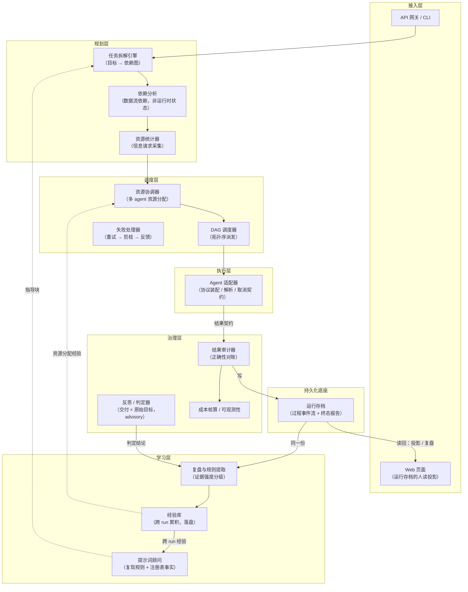
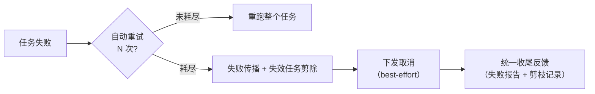

# Agents 编排框架 — 架构设计文档

> 版本：v1.0
> 更新日期：2026-09-24
> 状态：四阶段实现完成，六层详细设计完成；468/468 测试通过

---

## 1. 定位

### 1.1 定义

**结果导向（Result-driven）的 Agent 编排框架**。框架统一下发任务、统一回收结果，覆盖"任务拆解 → 资源协调 → 调度分配 → 结果审计 → 自我学习"的完整链路；框架不观测 agent 的执行过程与内部状态，一切判断以结构化结果契约为唯一依据。

### 1.2 与主流编排框架的边界

| 维度 | LangGraph / CrewAI 等 | 本框架 |
|---|---|---|
| 编排范式 | 过程导向（状态机、断点、消息流转） | 结果导向（以结果契约为驱动；仅框架自身的调度状态可持久化） |
| 运行时状态 | 全程维护 agent 状态 | 不观测 agent 过程；仅持久化框架侧调度状态（用于崩溃恢复） |
| 干预能力 | 可在执行中途介入 | 任务一旦下发，仅等待结果或下发取消 |
| 差异化能力 | 协作拓扑、记忆、工具链 | 资源统计、多 agent 资源协调、自我学习 |

> 编排的实质是"协调多个独立执行单元完成统一目标"，包含六个环节：分解 → 规划 → 分配 → 调度 → 汇聚验证 → 反馈。本框架对六个环节均有对应实现（见 §6）。

---

## 2. 设计原则

| # | 原则 | 说明 |
|---|---|---|
| D1 | 任务拆解即分解 | 分解与规划合并为"任务拆解"，产出带依赖关系的任务图 |
| D2 | 结果导向与断点持久化正交 | 框架不观测 agent 内部过程，只回收结果契约；框架自身的调度状态（任务图、任务状态、分配记录、剪枝记录）以事件驱动方式落盘，崩溃后恢复续跑。恢复策略为 A+B：无副作用任务重派，声明副作用的任务置为待人工确认（2026-08-15 修订"不做断点"的旧结论，旧理由为阶段一求简的工程取舍，非设计必然） |
| D3 | 失败处理分层 | 自动重试 N 次；重试耗尽后传播失败并剪除失效任务；统一收尾反馈 |
| D4 | 工程约束 | ① 取消为尽力而为（best-effort），不违背后端无状态原则；② 竞态处理先冻结派发再传播取消；③ 结果契约包含副作用声明 |
| D5 | 提示词即协议 | 与 agent 的沟通格式即格式化提示词模板，随请求注入；agent 零适配，仅接收任务请求与信息请求两类消息；格式演进仅修改模板，详见 [messaging-protocol.md](./messaging-protocol.md) |
| D6 | 协议与传输解耦 | 协议规定"说什么"（模板 + 请求 JSON），适配器决定"如何传输"。上行（使用方 → 框架）经 HTTP API 网关；下行（框架 → agent）经适配器，默认 OpenAI 兼容的 chat completions 端点 |

---

## 3. 总体架构

### 3.1 分层架构



> 交互式架构总览图（HTML）：[architecture-diagram.html](./architecture-diagram.html)

### 3.2 各层模块与职责

**接入层（ACCESS）**

| 模块 | 职责 | 输入 → 输出 |
|---|---|---|
| API 网关 | 框架的 HTTP 服务入口。承载目标拆解、任务图提交、进度快照、收尾报告、运行枚举、人读投影、叙述摘要、运行指标、运行取消、断点恢复、人工确认、agent 档案、跨 run 经验库等端点，并负责任务的后台执行与生命周期管理 | HTTP 请求 → JSON 响应 / 后台任务 |
| Web 页面 | 服务端渲染的运行列表与运行详情（同源、零构建、零跨域）。详情页呈现完整执行过程：过程时间线、任务与结果、分配记录、失败传播、治理结论、学习规则 | 运行存档 → HTML |
| CLI（`ao`） | 网关的轻量客户端（仅依赖标准库）。提供目标拆解、任务图提交、进度、报告、指标、取消、恢复、人工确认、agent 档案、经验库、运行枚举、运行视图、叙述摘要等子命令，并提供交互式会话 | 命令行参数 → HTTP 请求 |
| 编程式接口 | 库内嵌调用：同步入口（单次运行）与异步入口（并发运行，运行间状态隔离） | 任务图 → 调度报告 |

**规划层（PLAN）**

| 模块 | 职责 | 输入 → 输出 |
|---|---|---|
| 任务拆解引擎 | 由大模型将自然语言目标拆解为子任务及其数据流依赖，产出任务图；拆解结果为框架内部调用，不经消息协议。拆解提示词结构为"固定指令 → 学习层指导块 → 用户目标"，指导块由学习层提供 | 目标 → 任务图 |
| 依赖分析 | 任务图的结构视图：引用合法性、无环检测、拓扑序（并列节点按插入序，保证确定性）、拓扑分层（并行前沿）、最大并行宽度、可达性与反向可达、交付点判定。纯结构计算，不读取运行时状态 | 任务图 → 结构分析结果 |
| 资源统计器 | 注册 agent 实例，经信息请求采集能力、资源与约束声明并解析入库，维护画像刷新。注册记录的字段为"agent / 能力 / 限制（功能限制 + 性能限制）"。刷新策略为池级惰性刷新（超过生存期即重新采集）与派发前决策点校验（复核易变维度）；采集受框架侧墙钟上限约束 | agent 池 → 资源画像 |

**调度层（SCHEDULE）**

| 模块 | 职责 | 输入 → 输出 |
|---|---|---|
| 资源协调器 | 三级分配策略（精确匹配 → 能力匹配 → 降级），同模型多实例轮询分流，连续失败达到阈值后摘除。只读取资源画像，不执行采集 | 资源需求 + 资源画像 → 分配记录 |
| DAG 调度器 | 按拓扑序派发任务、传递上游结果、执行重试与退避、强制并发上限与速率配额、处理失败传播与取消竞态。提供同步顺序执行与异步并发执行两种实现 | 任务图 + 分配记录 → 调度报告 |
| 失败处理器 | 重试 → 失败传播 → 失效任务剪除 → 统一反馈。该能力跨三层协作，不构成独立模块：剪枝算法属于图结构计算，取消下发与派发冻结属于调度控制流 | 失败事件 → 剪枝结果 + 取消记录 |

**执行层（EXECUTE）**

| 模块 | 职责 | 输入 → 输出 |
|---|---|---|
| Agent 适配器 | 装配协议提示词（模板 + 请求 JSON + 上游输入），调用模型，并对响应执行两级校验与解析重试；提供同步与异步两条调用路径；从模型 API 响应回填真实用量与耗时 | 任务 → 提示词请求 → 结果契约 |
| Agent（外部） | 接收请求并返回符合结果契约的 JSON，不为框架做任何适配 | 提示词 → JSON 响应 |

**治理层（GOVERN）**

| 模块 | 职责 | 输入 → 输出 |
|---|---|---|
| 结果审计器 | 对账事实：任务状态与结果契约的一致性、缺失契约、迟到结果、分配（降级与风险）、剪枝、副作用声明与实际报告的交叉校验、错误模式归集。只读、可复跑、确定性 | 结果契约集 → 审计报告 |
| 反思 / 判定器 | 运行级语义判定：以原始目标为唯一基准，判断最终交付是否达成目标，产出达成结论、评分与缺口。判定者取自注册表中声明判定能力的独立 agent，缺省时允许降级自判并标记非独立，或跳过。判定为 advisory：只写入报告并供学习层消费，不改变状态、不阻断交付、不自动重派；与确定性审计分离记录，成本单列，判定产物不再被判定 | 原始目标 + 调度报告 → 判定结论 |
| 成本核算 | 按 agent 与分配方式归集成本与 token，单独列示失败成本与剪枝已发生成本，并针对 agent 的预算声明执行超支判定 | 调度报告 → 成本报告 |
| 可观测性 | 按运行隔离的指标聚合与结构化日志；日志覆盖请求、响应、解析、取消全链路 | 运行事件 → 指标 / 日志 |

**学习层（LEARN）**

| 模块 | 职责 | 输入 → 输出 |
|---|---|---|
| 复盘与规则提取 | 运行收尾时对同一份报告执行只读复盘：审计对账、成本归集、规则提取（含判定结论）。规则按证据强度分级：客观（确定性事实）与判定（大模型结论）；同一入口统一补齐分级，禁止同级呈现 | 审计报告 + 成本报告（+ 判定结论） → 学习报告 |
| 经验库 | 将规则落盘并按规则标识聚合为跨 run 摘要：命中次数、贡献运行数、最高严重度、最近证据。单次运行内的阈值统计意义有限，跨运行复现才是客观依据 | 学习报告 → 跨 run 摘要 |
| 提示词顾问 | 生成拆解提示词中的指导块：注册表实测事实（可用模型、已注册能力标签）与达到复现门槛的客观规则；判定结论单独成节并标注来源。指导块缺失或异常时退化为不注入 | 经验库 + 资源画像 → 指导块 |

**持久化底座（STORE）**

| 模块 | 职责 | 输入 → 输出 |
|---|---|---|
| 运行存档 | 运行存档由过程事件流（状态变更逐条落盘，可回放）与终态报告（治理与学习产物附载）构成，单次运行不可变，是框架的唯一权威来源。档案支持读回与运行枚举，跨进程重启后仍可查询 | 调度事实 → 不可变存档 → 投影 / 复盘 |

### 3.3 Agent 接入方式

- **默认形态**：agent 以 HTTP 服务暴露 OpenAI 兼容的 chat completions 端点。该端点已为模型服务的事实标准（OpenAI、DeepSeek、vLLM、Ollama 及自建 agent 均可提供）。框架作为客户端主动调用，符合协议原则 P1（框架永远主动）。
- **配置即接入**：兼容端点仅需一条注册配置，框架零代码改动。配置项为端点地址、模型名与密钥（密钥亦可由环境变量提供）。
- **不兼容的自建系统**：仅需实现一个发起调用的扩展点（约 20 行），协议装配、两级校验、解析重试与成本回填均由适配器基类统一复用。
- **同进程 agent**：以进程内适配器直调本地函数，省去序列化与网络往返。协议约束与稳定性保障与 HTTP 形态完全一致。
- **批量注册**：注册表可由配置文件（YAML / JSON）或字典批量构建。配置项仅包含接入要素（端点地址、模型名、密钥来源），能力、并发、预算等声明一律由信息请求采集，不写入配置。
- **协议与传输解耦**：协议内容（模板 + 请求 JSON，见 [messaging-protocol.md](./messaging-protocol.md)）对所有接入方式相同；更换传输方式仅需新增适配器，模板与请求 JSON 不变。
- **方向区分**：上行（使用方 → 框架）经 API 网关，框架为服务端；下行（框架 → agent）经适配器，框架为客户端。两条链路均为 HTTP，但角色相反，各自独立。

---

## 4. 数据模型

### 4.1 任务

```json
{
  "id": "task_001",
  "desc": "拆解后的子任务描述",
  "deps": ["task_000"],
  "output_schema": {"summary": "string", "top_trends": ["string"]},
  "required_resources": {"model": "deepseek-chat", "budget": 1.2, "timeout": 300},
  "required_capabilities": ["代码审查", "数据分析"],
  "status": "pending | running | success | failed | cancelled | skipped | interrupted",
  "side_effects": "none | external_api | file_write"
}
```

- `required_resources.timeout`：单次执行的墙钟上限（秒），由框架强制执行。超时即中断并判为失败（错误码为 `timeout`），汇入重试与剪枝链路；同时随约束声明下发给 agent 作为建议值。取值小于等于 0 表示不设上限。重试各自计时，故单任务最长占用约为 `timeout × (重试次数 + 1) + 退避`。
- `output_schema`：期望输出结构，采用简化 Schema 方言（见协议 §7.2）。框架对成功响应的产出结构执行强制校验：字段缺失或类型不符即判失败，汇入解析重试与失败传播；未声明则不校验。
- `required_capabilities`：任务的能力需求标签，由拆解层声明，供分配层匹配 agent；为空时仅按模型匹配。

### 4.2 结果契约

结果契约是框架全部逻辑的枢纽，审计、资源协调与自我学习均以它为输入。

```json
{
  "request_id": "req_0001",
  "task_id": "task_001",
  "success": true,
  "output": { },
  "error": null,
  "usage": {"tokens_in": 1200, "tokens_out": 800, "cost": 0.42},
  "duration_ms": 12345,
  "retries": 2,
  "side_effect_report": "已提交外部订单 #A88"
}
```

- `request_id` 与 `task_id` 用于对账（协议 §7.7 要求原样回带）。简化版模板下可缺失，由框架补值，对账相应降级。
- 用量与耗时以模型 API 响应的真实值为准，agent 自报仅作备用。
- 结果契约缺失即链路中断，因此它是不可省略的硬性约定。

### 4.3 依赖图

- 节点为任务，边为**数据流依赖**（非运行时状态）。
- 调度器仅按拓扑序工作：入度为零的任务可派发。
- 失败传播与失效任务剪除均在该图上执行图算法（见 §5）。

### 4.4 调度报告与分配记录

调度报告是一次调度的收尾产物，包含结果集、剪枝记录、分配记录、总成本与终态；其终态取值包括成功、部分成功、失败、已取消、已中断。治理层与学习层在运行收尾时把审计、成本、学习与判定产物附载到同一份报告上。分配记录保存每个任务的 agent 归属、分配方式（精确 / 能力 / 降级）、原因与风险标记。

### 4.5 消息沟通协议

框架与 agent 之间唯一的沟通方式是"提示词即协议"：格式化提示词模板随请求注入，agent 零适配，仅接收任务请求与信息请求两类消息；格式与内容演进仅修改模板文本。详见 [messaging-protocol.md](./messaging-protocol.md)。

---

## 5. 失败处理

### 5.1 分层策略

框架侧墙钟超时是失败来源之一。单次尝试超过 `required_resources.timeout` 时，框架强制中断调用（异步路径取消内层协程，同步路径等待守护线程），产出错误码为 `timeout` 的失败结果。该机制避免 agent 无响应时并发名额被长期占用（相应地使配额等待有界），且不依赖 agent 配合。超时不改变下行协议中约束字段的语义：`constraints.timeout_seconds` 仍是下发给 agent 的建议值，执行者始终是框架自身。



### 5.2 反向可达性剪枝

任务 T 重试耗尽后，剪枝过程如下：

1. 取消 T 的全部后代（输入链已断裂）。
2. 若所有最终交付任务均被取消（存活交付点为空），则整棵任务图取消，流程结束。
3. 否则以所有仍存活的交付点为根，沿依赖边反向遍历：可达的任务保留，不可达的任务全部取消。判据可表述为"该任务的产出是否仍被最终交付消费"——若无人消费，则其执行无意义。

多交付点语义：交付点集合可包含多个任务。只要存在存活交付点，其他分支中已完成的任务予以保留，独立交付分支不受牵连。该规则可统一表述为反向可达公式：存活交付点为空即取消全集，等价于整棵取消。

该判据同时覆盖"与 T 并行但最终需汇合"的任务——汇合点消失后，反向遍历不可达，一并剪除。剪枝属于调度层动作（撤销后续派发），不侵入 agent 内部，不违背原则 D2。

### 5.3 竞态处理

取消传播存在延迟，因此按以下顺序处理：

1. 冻结新派发（暂停入度为零任务的派发）。
2. 逐级下发取消信号（best-effort）。
3. 统一收尾：迟到的结果直接丢弃，按取消记录核算。

### 5.4 取消记录

取消记录同时作为审计与学习的输入。

```json
{
  "root_failure": {"task_id": "task_002", "reason": "model_timeout", "retries": 3},
  "pruned": [
    {"task_id": "task_007", "state_at_cancel": "running",  "prune_reason": "downstream_chain"},
    {"task_id": "task_008", "state_at_cancel": "pending",  "prune_reason": "unreachable_from_final"}
  ],
  "pruned_final": false
}
```

- 审计：被剪任务的已发生成本计入成本核算，不视为浪费。
- 学习：复盘"本次拆解为何产生无意义的并行任务"，沉淀为拆解优化规则。

### 5.5 断点持久化

断点持久化与结果导向不冲突：断点仅保存框架侧的调度状态，不涉及 agent 内部状态。

- **状态存储抽象与 SQLite 实现**：单文件、零依赖，可替换为其他关系型存储。经验库为可选能力，存储实现未支持时退化为无跨运行记忆。
- **事件驱动写入**：任务状态变更（置为运行中、终态、剪枝、取消）即落盘，不做定期快照，故崩溃点数据最新，丢失窗口近似为零。
- **恢复入口**：网关提供运行恢复端点（`POST /api/runs/{id}/resume`）。
- **运行级目标一并落盘**：提交时可选择提供原始目标（判定基准），存为运行记录的目标字段；未提供时的高频落盘保留原值，恢复后判定仍以同一基准进行，避免崩溃恢复后基准丢失。

对崩溃瞬间处于运行中的任务，采用 A+B 恢复策略：

| 任务类型 | 策略 | 理由 |
|---|---|---|
| 无副作用（纯产出） | A：重置为待执行，自动重派 | 重复执行的最坏损失为一次成本；协议前提即纯产出 |
| 声明副作用 | B：置为待人工确认，不重派 | 重派可能导致副作用执行两次，不可逆 |
| 已终态（成功 / 失败 / 取消 / 跳过） | 保留，复用其结果、成本与审计记录 | 不重跑、不重计费 |

- **人工出口**（最小人工介入，仅用于事故恢复）：网关提供人工确认端点（`POST /api/runs/{id}/tasks/{tid}/resolve`），动作为 complete（附人工核实的结果契约）、cancel 或 retry（retry 后需再次恢复）。
- 中断任务的下游若被跳过，在人工确认后恢复时，依赖满足（全部成功）会自动重新变为可派发。
- 中断任务计入审计（warning），并触发学习规则 INT-1（检查崩溃原因与副作用声明质量）。
- 关键前提（冒烟测试发现并修复）：运行状态必须在任务启动时即落盘，否则副作用任务崩溃恢复后会被当作普通任务重派，A+B 策略被绕过。

### 5.6 运行存档

**归属**：运行存档落在**持久化底座**，不归学习层或治理层。判据与失败处理器一致：被多方依赖且自身不含策略者，即为底座。审计、成本、判定与学习层均需读写该档案；若置于学习层，治理层将反向依赖学习层获取自身输入，导致层序倒置。治理层是档案的生产者之一（审计、成本、判定附载回报告），学习层是消费者（读取同一份档案生成经验库）。数据流为环形而非两级传递：两者分别对同一份档案执行写与读。

**产物三分离**（尺度不同，不可混同）：

| 产物 | 归属 | 尺度 | 角色 |
|---|---|---|---|
| 运行存档（过程 + 终态报告） | 持久化底座 | 单次运行 · 不可变 | 完整报告 / 可追溯证据来源 / 唯一权威来源 |
| 经验库（规则聚合） | 学习层（经底座落盘） | 跨运行 | 后续任务的数据基础 |
| 人读投影 | 读时渲染 | 按需 | 展示与查阅 |

**过程以事件流记录**：状态变更（启动、派发、完成、剪枝、丢弃迟到结果、取消、恢复、收尾）逐条落盘为过程事件流。事件流与结构化日志共用同一处调用点与同一套事件名，避免两套命名分叉。由于不仅保存终态，过程可精确回放，并作为 Web 时间线的数据来源。终态报告承载治理与学习产物。

**读回与枚举**：终态报告支持读回（早期仅写不读，进程重启后已完成运行的报告无法获取，现由底座读回）；运行支持枚举（`GET /api/runs` / `ao runs`），跨进程重启后仍可发现已有运行。

**人读版为按需渲染**：人读投影是运行存档的读时投影，为纯函数——同一份存档渲染出同一份视图，可复跑、零成本、不含大模型调用。人读版不默认生成、不落盘。理由与"源 Markdown → HTML 发布副本"一致：存档为唯一权威来源，视图是它的纯函数；若默认全量生成，将引入第二份真相，需仲裁何者为权威，必然导致分叉。

**叙述摘要（唯一例外，非确定）**：以一段文字概括得失属大模型产出，非确定且有成本，因此仅支持显式触发（`POST /api/runs/{id}/narrative`），单独成节、标注来源（模型与生成时间）、写入独立表留档，绝不默认生成，也不混入确定性报告（原则与"判定与审计分离"一致）。唯一的常态落盘例外是显式导出（例如发布到静态目录），属于刻意的发布操作，而非运行收尾的默认副作用。

**入口汇总**：Web 页面 `GET /` 与 `GET /runs/{id}`；JSON 端点 `GET /api/runs`（枚举）、`GET /api/runs/{id}/view`（确定性投影）、`POST /api/runs/{id}/narrative`（非确定）；CLI 子命令 `ao runs`、`ao view`、`ao narrate`。Web 页面由网关服务端渲染，同源、零构建、零跨域。

---

## 6. 编排定位对照

| 编排环节 | 本框架对应模块 | 说明 |
|---|---|---|
| 分解 | 任务拆解引擎 | 任务图由大模型动态生成 |
| 规划 | 依赖分析 | 数据流依赖 |
| 分配 | 资源统计与资源协调 | 差异化能力 |
| 调度 | DAG 调度器 | 拓扑序派发与取消 |
| 汇聚验证 | 结果审计 | 正确性与成本对账 |
| 反馈 | 自我学习 | 差异化能力 |

- 相对工作流引擎：本框架的任务图由大模型动态生成，而非静态固定流程，属编排范畴。
- 相对编制（Choreography）：本框架为中心化统一调度，而非去中心化自主协作，属编排范畴。
- 相对过程编排：本框架为结果导向形态，属编排的精炼子集。

---

## 7. 关键技术决策

| # | 决策 | 理由 |
|---|---|---|
| T1 | 结果导向，不维护 agent 过程状态 | 大模型本身以结果为导向，框架不引入过程复杂度 |
| T2 | 以数据流依赖而非运行时状态描述依赖 | 唯一必须保留的依赖关系是输入与产出的关系 |
| T3 | 失败后先重试、后剪枝 | 对偶发失败（如超时）直接剪除整棵子树成本更高 |
| T4 | 取消为调度层动作 | 不侵入 agent，保持结果导向原则 |
| T5 | 副作用声明纳入结果契约 | 避免剪枝与审计对副作用产生误判 |

---

## 8. 实现进度与变更历史

编号约定：阶段二为治理与学习，阶段三为资源统计与任务分配，阶段四为并发执行模型。
实现顺序为三 → 二 → 四：并发模型依赖资源统计提供的并发度上限，以避免盲目并发触发上游限流；审计数据面在任务分配落地后建模，可直接按多 agent 归属一步到位，避免返工。

**四阶段（已完成）**

- [x] **阶段一 · 核心闭环**（2026-08-14）——任务拆解（依赖图）+ DAG 调度器 + 结果契约 + Agent 适配器（DeepSeek）+ 失败处理（重试 N=2、指数退避、失败传播、失效任务剪除、取消契约，见 T3 / T4）。解析组件与剪枝共 50/50 测试通过，见 §10。
- [x] **阶段三 · 资源统计与任务分配**（2026-08-15）——能力注册表、信息请求采集、多 agent 资源协调与任务分配。能力、资源与约束经信息请求采集解析入库（可刷新，单点失败隔离）；分配三级策略全程记录（精确匹配、同模型多实例轮询；能力匹配、部分覆盖标记风险；降级，显式记录）；连续失败达到阈值后自动摘除；能力需求由拆解层声明。76/76 测试通过，见 §10。
- [x] **阶段二 · 治理与学习**（2026-08-15）——审计器、成本核算与学习规则提取。审计执行正确性对账（状态与结果契约矛盾、缺失契约、迟到结果）、分配审计（降级与风险记录）、剪枝审计（§5.4 取消记录归集）、语义交叉校验（§7.5 副作用声明与实际报告）与错误模式归集，结论分三级（ok / warning / critical）；成本核算按 agent 与分配方式归集成本与 token，单独列示失败成本与剪枝已发生成本（§5.4 定义），并含预算超支判定（声明为 0 时不判定）；规则提取覆盖六类（REC / FP / DEG / CAP / BUG / PRU，阈值可配，附证据与动作建议）。115/115 测试通过，见 §10。
- [x] **阶段四 · 并发执行模型**（2026-08-15，依赖阶段三）——asyncio 并发调度、多模型接入、可观测性与 API 网关。事件驱动并发派发（任一任务完成即推进）；资源限制由声明转为强制执行：按 agent 的并发上限（信号量）与速率配额（滑动窗口限速，时间戳队列，窗口边界无 2 倍突发）。配额阻塞不等于不可达：就绪任务因并发名额被其他运行占用时短暂等待后重派，仅在因依赖失败或取消而确实无可派发时防御性跳过。竞态处理见 §5.3（冻结派发 → 剪枝 → 逐级取消 → 收尾 → 解冻）；迟到结果直接丢弃；执行期间被剪枝即停止重试；外部取消对整棵任务图生效，已完成任务不回收；单实例可并发运行多个任务图，运行状态全部在按运行隔离的上下文中维护。适配器异步化：异步路径默认将同步实现置于线程池，HTTP 形态实现真异步，故仅有同步实现的 agent 无需改动即可参与并发调度；真实用量回填（真实模型不自报用量，由适配器从 API 响应捕获 token 与耗时回填结果）。可观测性：按运行隔离的指标聚合与结构化日志。API 网关：提交任务图、进度快照、收尾报告、指标、取消与 agent 档案。151/151 测试通过，见 §10。

**增强与加固（独立于四阶段）**

- [x] **断点持久化**（2026-08-15，见 §5.5）——状态存储抽象与 SQLite 实现（事件驱动落盘）、调度器恢复入口（A+B 恢复策略、依赖恢复、已完成结果复用）、网关的恢复与人工确认端点、审计的中断标记与学习规则 INT-1。实测：无副作用任务执行中崩溃后可恢复重派并续跑；副作用任务执行中崩溃后置为中断，经人工确认后继续。修复关键缺陷：任务启动即须落盘，否则副作用任务崩溃恢复后会被当作普通任务重派，A+B 策略被绕过。168/168 测试通过，见 §10。
- [x] **多运行并发加固与一致性收尾**（2026-09-02）——① 就绪任务因并发名额被其他运行占用时等待后重派（原缺陷将配额阻塞误判为依赖失败不可达，导致并发提交的运行全任务被误标跳过且终态误报成功，静默丢失交付）；② 峰值并发按 agent 统计（原将整条链路运行中的任务数记入单个 agent，多 agent 并行时峰值虚高）；③ 限速器实现为滑动窗口（窗口边界无 2 倍突发，实现与文档定义一致）；④ 交互式会话对非预期异常（文件缺失、JSON 损坏等）报错但不退出；⑤ 静态检查清零。221/221 测试通过，见 §10。
- [x] **约束分流与运行中快照归属**（2026-09-07）——① 功能限制采集分流：原将"工作时间"等时间窗短语整段并入禁忌项，污染约束匹配、审计与学习的输入定义；现按规则分流，"无"（含空白变体）不计入任何一方。② 运行中快照的 agent 归属：原依赖收尾报告，运行中归属恒为空；现由调度器托管运行中的分配映射，派发即有归属，异常路径不留残留状态。224/224 测试通过，见 §10。

**规划层详细设计**

- [x] **时间窗字段删除与资源池刷新策略**（2026-09-23）——① 时间窗字段删除（采集但无消费方，属悬空声明；约束定义收敛为功能限制与语言，时间窗文本从禁忌项剔除）；② 资源池刷新采用惰性刷新与决策点校验：池级画像在读取时若已过期即重新采集（新鲜时零开销），保证三级分配所见池级画像不过期；派发前对选中的 agent 复核易变维度（资源与约束，能力变化较慢由池级生存期覆盖），校验失败保留上次已知值且不阻塞派发（同步与异步双路径一致，可关闭）。232/232 测试通过，见 §10。
- [x] **拆解接入、拆解引擎测试与修正重试、执行层超时**（2026-09-23）——① 拆解接入：规划层头部的"目标 → 任务图"原仅在库内可用，对使用方不可达（提交入口仅接收现成任务图）；新增网关端点 `POST /api/decompose`（`submit=true` 时拆解后直接提交并返回运行标识，实现端到端）与 CLI 子命令 `ao decompose --goal '...' [--submit]`（不提交则打印任务图 JSON 供审阅或落盘）。拆解为框架内部大模型调用，不经消息协议，默认复用 DeepSeek 的聊天入口（同一套端点与鉴权，密钥读取环境变量）；应用未注入拆解引擎时该端点返回 400，框架其余功能不受影响。② 拆解引擎重试原则与配置：重试改为携带失败原因与正确示例（与解析组件一致，原为原样重放同一提示词）；构造参数 temperature 原为未使用参数，现按调用方能力注入。补充拆解引擎测试 28 项（Schema 逐项断言、修正重试、参数注入、重试耗尽）。③ 执行层墙钟超时：任务声明的超时原仅随请求下发、框架侧无消费方，agent 无响应时会永久占用并发名额、运行停在运行中空转；现单次尝试超时即由框架强制中断（异步取消内层调用并释放名额，同步等待守护线程），产出超时错误码并汇入既有重试与剪枝链路，取值小于等于 0 时关闭。同时修复 CLI 剪枝根因输出恒为空。冒烟新增"目标 → 任务图 → 结果"全链路。278/278 测试通过，见 §10。
- [x] **依赖分析独立与注册表按层切分**（2026-09-23）——① 依赖分析独立成型：架构声明的"依赖分析"此前实际为空，图算法分散内联于拆解引擎与任务模型中，独立结构视图并不存在。现收敛为独立的结构视图：邻接查询、拓扑序（并列节点按插入序，确定性）、拓扑分层（并行前沿）、最大并行宽度、可达性与反向可达、成环与引用校验、交付点判定；不读取运行时状态，与"数据流依赖、非运行时状态"一致，任务模型保留同名薄委托。拆解产物的合法性校验改由其承担；拆解响应新增结构分析（分层、并行宽度等），规划层此环节首次有真实产物。② 注册表按层切分：原注册表同时承载规划层职责（注册、采集、声明解析、刷新、画像查询）与调度层职责（分配、轮询、摘除），未按层切分；现按六层架构分离为规划层资源统计器与调度层资源协调器（后者只读画像、不采集），注册表收敛为零逻辑转发的门面，公开接口与既有导入路径全部保持可用。310/310 测试通过，见 §10。

**调度层详细设计**

- [x] **取消下发统一与未使用参数清理**（2026-09-23）——① 取消下发收拢为统一原语：原在三处各写一份结构重复的循环，且行为不一致——内部剪枝路径失败可观测，整棵取消路径静默吞掉异常，同步路径无容错。现两条路径共用一个原语，best-effort 语义不变（agent 是否配合均不阻塞收尾，迟到结果由状态机丢弃），并统一保留失败可观测（不再静默）；同步路径保留为契约预留（同步模型逐任务串行，剪枝时不存在运行中任务，与异步定义对齐）。② 删除同步调度器的未使用参数：构造参数保存但未消费（同步调度器无重试退避），属声明与消费不一致的字段；并发特性（退避、限流、竞态）为异步专属，不反向收敛（同步顺序执行时并发名额恒为空操作，补齐无收益）。③ 修复依赖分析的确定性缺陷：邻接结构原用无序集合，字符串散列随机化使并列节点顺序在进程间不可复现，拓扑序与分层偶发翻转，与确定性声明相悖；现改为插入序结构，并由边集计算入度（重复声明同一依赖不再重复计入度，不再误报成环）。319/319 测试通过（多种散列种子复跑恒定），见 §10。

**治理层详细设计**

- [x] **运行级目标持久化与反思 / 判定（独立判定者，advisory）**（2026-09-23）——背景：框架此前仅在契约与结构层面判定"结果符合预期"（解析组件硬性约束与审计事实对账），产出内容的正确性无人判定，格式正确但内容错误的结果会被判成功，语义正确性完全依赖 agent 自报与人工阅读报告。① 运行级目标持久化：判定基准为用户原始目标，而目标原本不落盘、提交后即丢失；现提交时可选提供目标（拆解入口自动带上；直接提交现成任务图可不提供，此时判定跳过），写入数据库为运行记录的目标字段（既有库打开时自动补列；未提供时的高频落盘与局部变更均不覆盖提交时写入的目标），恢复后判定仍以同一基准进行，快照与报告均暴露目标。② 反思 / 判定：运行级判定，基准只能是原始目标（子任务描述是框架自产的拆解产物，用作基准即循环论证），交付任务产出为待验对象，过程任务结果仅作证据（含失败与剪枝事实）；判定者优先取自注册表中声明判定能力的独立可用 agent（能力经信息请求采集，可为异构模型，以避免自评），无此类 agent 时按是否允许自判的开关降级并标记独立性，或直接跳过。判定即一次普通任务请求（消息类型零新增、agent 零变更），经协议装配、结构强校验、解析重试与真实元数据回填，调用受框架侧墙钟超时约束；超时、异常或判定 agent 报失败一律收敛为错误码，不向上抛出。③ advisory 语义与边界：结论写入报告并供学习层消费（新增 JUD-1 目标未达成与 JUD-2 判定未产出结论两条规则，向后兼容）；不改变任务状态、不阻断交付、不自动重跑（副作用任务重派即执行两次，为既有红线）；与确定性审计严格分离（审计只读、可复跑、确定性；判定非确定、有成本、不可复跑），判定成本单列且不计入任务总成本，判定产物不再被判定（递归边界）；判定异常不影响运行收尾。387/387 测试通过（多种散列种子复跑恒定），见 §10。

**执行层详细设计**

- [x] **输出结构强校验与采集超时**（2026-09-23）——① 输出结构强校验：期望输出结构原仅作提示随请求下发、框架侧无强制，成功响应的产出结构可静默偏离期望。现补为两级校验的第二层：按简化 Schema 方言（类型标识、并集、数组（元素可嵌套）、嵌套对象、枚举）校验成功响应的产出；列出的字段为必需，多余字段容忍，未知 spec 形态与未知类型标识保守不强制（不因 schema 书写问题误判 agent），完整 JSON Schema 节点整体跳过（结构一致性仍由审计按 §7.5 记录）；不符即判失败并进入修正重试（修正提示一并给出期望结构），仍失败则汇入既有重试与剪枝；简化版模板、信息请求、取消请求与失败响应不做此校验。② 采集墙钟超时：信息采集原无框架侧上限，与任务执行（§5.1）不对称，卡死会无上限地拖住调用方（运行起始的池级刷新、派发前的决策点校验）；现设默认 30 秒上限（取值小于等于 0 时关闭），同步与异步双路径一致，超时按单点采集失败处理（保留该 agent 上次已知画像，不中断其余 agent）。同时将墙钟超时原语抽为执行层与规划层共享的一份，避免重复实现。347/347 测试通过，见 §10。

**学习层详细设计**

- [x] **确定性复盘接入生产路径、跨运行经验库落盘与拆解提示词回馈**（2026-09-23）——背景：学习层此前仅存在于库与测试中，未接入生产调用，且产物不落盘——治理件只出现在测试与冒烟脚本中（网关与 CLI 均未调用），规则不落盘（状态存储仅有运行表与分配表），动作建议为自由文本、无消费方、无机器可读输出，"规则库 / 经验库"零实现。① 确定性复盘接入生产路径：运行收尾时对同一份报告执行只读复盘——审计对账、成本归集、规则提取（含判定结论），产物附载回报告并由网关报告端点与 CLI 一并输出（审计结论、成本三项、规则表）；学习层为复盘而非主链路，任何异常均被隔离，不阻断运行收尾。② 跨运行经验库：规则新增证据强度分级（客观，为确定性事实：REC-1、INT-1、FP、DEG-1、CAP-1、BUG、PRU-1；判定，为大模型结论：JUD-1、JUD-2），分级在唯一入口补齐，防止将非确定结论伪装为事实；规则写入数据库为经验库表（同一运行重跑幂等覆盖），并聚合为跨运行摘要——同一规则的命中次数、贡献运行数、最高严重度与最近证据（单次运行内的阈值统计意义有限，跨运行复现才是客观依据）。③ 闭环出口为拆解提示词回馈：提示词结构改为"固定指令 → 学习层指导块 → 用户目标"（前后缀稳定，便于回归与经验积累），每次拆解前取一次指导块（缺失、空串或异常一律退化为不注入，学习层故障不影响拆解）；指导块内容为注册表实测事实（当前可用模型、已注册能力标签，直接测量无需阈值，可在拆解期即规避降级与能力风险）、达到复现门槛的客观规则（默认门槛 2 次，每条恒定附带"既往 N 次运行命中 M 次"的数值依据与建议动作，条数受限、超长截断）与判定结论（单独成节并显式标注非确定来源，客观与判定禁止同级呈现）；仅对拆解有指导意义的类别（FP、DEG、CAP、BUG、PRU、JUD）进入提示词，框架自身问题（REC-1 链路中断、INT-1 崩溃）不进入。④ 接入与观测：网关提供经验库端点 `GET /api/lessons`，CLI 提供 `ao lessons`；启动时装配提示词顾问并注入拆解引擎。435/435 测试通过（多种散列种子复跑恒定），见 §10。

**接入层详细设计**

- [x] **运行存档归档闭环、Web 页面、人读投影与叙述摘要**（2026-09-24）——背景：接入层此前仅有 API 网关与 CLI 轻量客户端，且运行存档只写不读——报告落盘后无读回路径（进程重启后已完成运行的报告无法获取），无过程时序（仅存终态，Web 无法回放执行过程），无运行枚举（换进程后无法发现已有运行）；接入层 Web 形态曾于早期被放弃，本次按要求重建。① 归档归属定为持久化底座（非学习层与治理层）：判据与失败处理器一致——审计、成本、判定与学习层均需读写该档案，若置于学习层则治理层反向依赖学习层获取输入，导致层序倒置；治理层为生产者之一，学习层为消费者，数据流为环形而非两级传递。② 过程以事件流记录：状态变更（启动、派发、完成、剪枝、丢弃迟到结果、取消、恢复、收尾）逐条落盘（过程事件表，与结构化日志共用同一处调用点与同一套事件名），过程可精确回放。③ 报告读回与运行枚举：底座补充报告读回与运行枚举能力（`GET /api/runs` / `ao runs`），进程重启后报告与运行列表仍可读取；网关报告端点增加底座读回。④ Web 页面（服务端渲染、同源、零构建、零跨域）：运行列表 `GET /` 与详情 `GET /runs/{id}`（详情含过程时间线、任务与结果、分配记录、失败传播、治理与学习）；人读版是运行存档的读时投影——按需渲染、纯函数（同一份存档渲染同一份视图，可复跑、零成本）、不落盘为第二份真相（定义同"源 Markdown → HTML 发布副本"）；新增确定性投影端点 `GET /api/runs/{id}/view` 与 CLI 子命令 `ao view`。⑤ 叙述摘要（非确定，唯一例外）：以一段文字概括得失属大模型产出，仅支持显式触发（`POST /api/runs/{id}/narrative` / `ao narrate`），单独成节、标注来源（模型与生成时间）、写入独立表留档，绝不默认生成，也不混入确定性报告；未注入叙述引擎时端点返回 400，确定性投影始终可用。新增 33 项测试（运行存档 10、人读投影与转义 10、网关存档与 Web 9、CLI 存档出口 4），累计 468/468 测试通过（多种散列种子复跑恒定），见 §10。

---

## 9. 历史定标项（均已结论）

1. 技术栈：已定 Python（2026-08-14），见 §10。
2. 重试参数默认值：已定 N=2 与指数退避（阶段一调度器已实现）。
3. 拆解引擎的模型与结构化输出格式：已定，采用 JSON 任务图并执行 Schema 校验。
4. 多 agent 资源池的资源维度：已定，为并发上限、速率配额与预算上限，阶段三落地，阶段四起由异步调度器强制执行（信号量与滑动窗口）。

## 10. 技术栈与工程基线

| 项 | 选择 | 说明 |
|---|---|---|
| 语言 | Python ≥ 3.10 | 生态成熟，为模型适配层首选 |
| 包管理 | pyproject.toml（setuptools） | 标准现代工程布局 |
| 数据模型 | pydantic v2 | 结果契约与任务模型的唯一事实来源 |
| 模型客户端 | openai SDK | 默认对接 OpenAI 兼容的 chat completions 端点（事实标准）。DeepSeek 适配器即该形态；agent 暴露兼容端点后，注册表配置端点地址、密钥与模型名即完成接入（§3.3） |
| 并发模型 | asyncio | 事件驱动并发调度；适配器默认将同步实现置于线程池以保持兼容 |
| API 网关 | FastAPI + uvicorn | REST 入口（提交、查询、报告、运行枚举、人读投影、取消、指标）与服务端渲染的 Web 页面（运行列表与详情，同源） |
| 解析组件 | 手写校验器（不引入 jsonschema） | 结果契约字段固定，手写实现更严格，且错误信息可直接用于修正提示 |
| 测试 | pytest | 解析组件与调度器优先覆盖 |

### 10.1 目录结构

```
agentsOrchestration/
├── pyproject.toml
├── docs/
│   ├── architecture.md
│   ├── messaging-protocol.md
│   └── architecture-diagram.html
├── scripts/
│   ├── mock_agents.py          # 本地 OpenAI 兼容 mock agent 服务（全流程测试无需真实模型）
│   ├── smoke_deepseek.py       # 真实 DeepSeek 端到端冒烟
│   ├── smoke_multiagent.py     # 多 agent 全流程冒烟（mock agents，--visual 产出 HTML）
│   ├── smoke_decompose.py      # 目标 → 任务图 → 结果 冒烟
│   ├── smoke_reflection.py     # 反思 / 判定冒烟
│   ├── smoke_learning.py       # 学习层闭环冒烟
│   ├── smoke_archive.py        # 运行存档与 Web 页面冒烟
│   └── smoke_resume.py         # 断点恢复冒烟（§5.5）
├── orchestration/           # 主包
│   ├── models.py            # 任务 / 结果契约 / 分配记录 / 依赖图（调度期状态操作）/ 调度报告
│   ├── dependency.py        # 依赖分析（规划层）：结构视图（拓扑 / 并行前沿 / 可达 / 校验）
│   ├── agent_pool.py        # 资源统计器（规划层）：注册 / 信息请求采集 / 声明解析 / 惰性刷新
│   ├── allocator.py         # 资源协调器（调度层）：三级分配 / 多实例轮询 / 连续失败摘除
│   ├── protocol.py          # 协议模板（完整版 / 简化版）+ 请求构造 + 渲染
│   ├── validation.py        # 解析组件：两级校验（提取 → 信封与输出结构校验）→ 解析重试
│   ├── timeouts.py          # 框架侧墙钟超时原语（任务执行与信息采集共用）
│   ├── decomposer.py        # 任务拆解：目标 → 依赖图 + 拆解 Schema 校验
│   ├── registry.py          # 注册表门面：组合资源统计器与资源协调器，零逻辑转发
│   ├── state_store.py       # 断点持久化与运行存档：事件流 / 报告 / 经验库 / 叙述（§5.5 / §5.6）
│   ├── scheduler.py         # 同步调度器：拓扑派发 + 任务分配 + 失败传播 + 剪枝
│   ├── scheduler_async.py   # 异步并发调度器：并发派发 + 竞态处理 + 资源限制
│   ├── metrics.py           # 可观测性：指标聚合 + 结构化日志
│   ├── audit.py             # 结果审计器：对账 / 分配审计 / 剪枝审计 / 交叉校验
│   ├── cost.py              # 成本核算：按 agent 与分配方式归集 + 预算判定
│   ├── reflection.py        # 反思 / 判定（治理层）：交付 × 原始目标 → 判定结论（advisory）
│   ├── learning.py          # 复盘与规则提取：规则分类 + 证据强度分级
│   ├── lessons.py           # 经验库与提示词顾问：跨运行聚合 + 拆解提示词回馈
│   ├── report_view.py       # 人读投影：确定性视图 + 文本 / HTML 渲染（Web 与 CLI 共用）
│   ├── narrative.py         # 叙述摘要（大模型，非确定）：显式生成、单独留档
│   ├── api/
│   │   └── gateway.py       # API 网关：运行生命周期管理 + REST 端点 + Web 页面（同源服务端渲染）
│   └── adapters/
│       ├── base.py          # 适配器抽象基类（同步与异步双路径）
│       ├── deepseek.py      # DeepSeek 适配器（OpenAI 兼容，真异步）
│       └── inprocess.py     # 进程内适配器（同进程 agent 直调本地函数，免 HTTP）
└── tests/                   # 468 项测试
```

---

## 11. 测试

测试覆盖重点：依赖分析（拓扑分层、并行前沿、可达性、成环与引用校验）、层职责切分（资源统计器与资源协调器）、解析组件（信封校验与输出结构强校验、重试容错）、剪枝算法（反向可达、多交付点语义）、并发竞态、速率限制、治理三项（审计 / 成本 / 学习）、网关生命周期、断点恢复（A+B 策略）、CLI 命令与请求构造、交互式会话、进程内适配器、配置批量注册、采集超时、学习层闭环（证据分级、经验库落盘与跨运行聚合、复现门槛、提示词注入与客观 - 判定分离）、运行存档（事件流、报告读回、运行枚举、叙述留档、级联清理与底座退化）、人读投影（确定性、结构、转义、运行中投影、HTML 渲染）、网关存档与 Web、CLI 存档出口。当前累计 468/468 通过。
