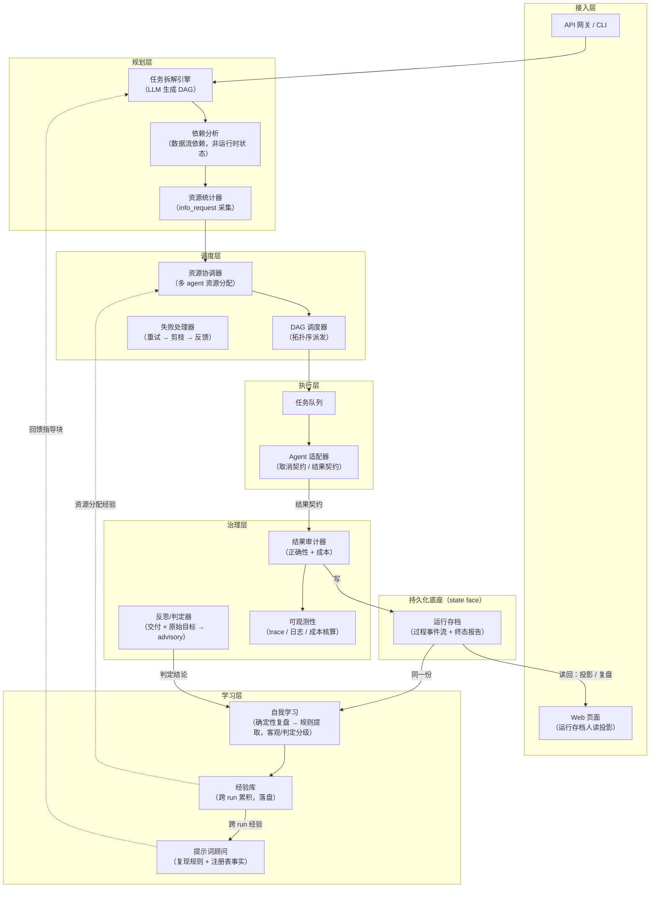
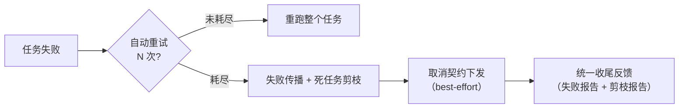

# Agents 编排框架 — 架构文档

> 版本：v1.0
> 日期：2026-08-15
> 状态：已实现（阶段一至四全部完成 + 断点持久化增强 + 多 run 并发加固 + 规划层接入 + 规划层切分（依赖分析独立 / 注册表分层）+ 调度层详细设计①（取消下发统一原语）+ 执行层详细设计①②（output_schema 强校验 / info 采集超时）+ 治理层详细设计①（反思/判定：run 级目标 + 独立 judge，advisory）+ 学习层闭环（确定性复盘 → 跨 run 经验库落盘 → 回馈拆解提示词）+ 接入层（运行存档归档闭环：过程事件流 + 报告读回 + 运行枚举；Web 页面 + 人读投影；叙述摘要），468/468 测试全绿）

---

## 1. 背景与定位

### 1.1 一句话定义

**结果导向（Result-driven）的 Agent 编排框架**：框架负责"任务拆解 → 资源协调 → 调度分配 → 结果审计 → 自我学习"的完整闭环，**不关心 agent 执行过程与内部状态，只以结构化结果契约驱动一切**。

### 1.2 与主流框架的边界

| 维度 | LangGraph / CrewAI 等 | 本框架 |
|---|---|---|
| 编排形态 | 过程导向（状态机、断点、消息流转） | **结果导向（只管结果契约；调度状态可断点持久化）** |
| 运行时状态 | 全程维护 | **不监控 agent 过程；仅持久化框架侧调度状态（断点）** |
| 干预能力 | 可中途介入 | 一旦派发，只等结果（或取消） |
| 差异化能力 | 协作拓扑、记忆、工具链 | **资源统计、多 agent 资源协调、自我学习** |

> 编排的本质是"协调多个独立执行单元完成统一目标"，分为六环节：分解 → 规划 → 分配 → 调度 → 汇聚验证 → 反馈。本框架六个环节全覆盖，是编排的精炼形态（详见 §6 对比）。

---

## 2. 核心设计原则（已确认决策基线）

| # | 决策 | 说明 |
|---|---|---|
| D1 | **任务拆解 = 任务分解** | 合并为"任务拆解"，输出带依赖关系的 DAG |
| D2 | **结果导向 + 断点持久化（不冲突）** | 框架不监控 agent 内部过程、只收结果契约；框架**自身**的调度状态（DAG/任务状态/分配/剪枝）事件驱动落盘，崩溃后恢复续跑——两者正交。恢复策略 A+B：纯产出任务重派，副作用任务置 INTERRUPTED 等人工（2026-08-15 推翻"无断点"旧决策，原理由是阶段一求简的工程简化，非哲学必然） |
| D3 | **失败处理分层** | 自动重试 N 次 → 耗尽后失败传播 + 死任务剪枝 → 统一反馈 |
| D4 | **工程要点** | ① 取消契约（best-effort，不影响"无状态"原则）② 竞态处理（先冻结派发再传播取消）③ 结果契约含副作用声明 |
| D5 | **提示词即协议** | 消息沟通格式 = 格式化提示词模板，随请求注入；agent 零适配，只接收两类请求（任务/信息）；格式演进只改模板，见 [messaging-protocol.md](./messaging-protocol.md) |

---

## 3. 总体架构

### 3.1 分层架构图



> 交互式架构总览图（HTML，专业排版）：[architecture-diagram.html](./architecture-diagram.html)

### 3.2 模块职责

| 模块 | 职责 | 关键输入 → 输出 |
|---|---|---|
| 接入层 Web 页面 | 服务端渲染的运行列表与详情页（**同源、零构建、零 CORS**）：`GET /`（运行列表）+ `GET /runs/{id}`（详情：过程时间线 + 任务与结果 + 分配留痕 + 失败传播 + 治理 + 学习）。**人读版是运行存档的读时投影**——按需渲染、确定性、可复跑，不落盘成第二份真相（同"源 `.md` → HTML 发布副本"范式） | 运行存档 → 人读投影（HTML / JSON / 文本） |
| 运行存档（归档） | 运行存档 = **过程事件流**（状态变更逐条落盘，可回放时间线）+ **终态报告**（治理/学习产物挂回），落**持久化底座**、单 run 不可变、**唯一真源**；报告**可读回**、run 可**枚举**（崩溃后 / 换进程后仍可查阅）。叙述摘要（LLM，非确定）另行单独留痕，不混入确定性报告 | 调度事实 → 不可变存档 →（读回）投影 / 复盘 |
| 任务拆解引擎 | LLM 将目标拆解为子任务 + 依赖 DAG；接入形态 = 网关 `POST /api/decompose` + CLI `ao decompose`（`--submit` 目标→DAG→提交一条链）；重试口径同协议 §7.3（失败原因 + 正确示例）；**提示词由学习层回馈**——拆解引擎开放经验注入接口，在固定指令与用户目标之间插入经验 / 注册表指导块（结构稳定：前缀恒为固定指令、结尾恒为用户目标） | 目标 → `DAG{Task[]}` |
| 资源统计器 | 经 `info_request` 采集 agent 能力 / 资源 / 约束声明（阶段三）；注册记录口径 = **agent / 能力 / 限制（功能 + 性能）**——constraint → 功能限制（forbidden/languages）、resource → 性能限制（并发/限速/预算），合规限制归后期安全层；刷新策略 = **TTL 惰性刷新 + 决策点校验**——池级画像读时过期即刷（新鲜零开销），派发前对选中 agent 复核易变维度（resource/constraint）；采集受**框架侧 wall-clock 上限**（默认 30s、`<=0` 关闭；与任务执行的超时对称）约束 | agent 池 → 资源画像集 |
| 依赖分析 | 数据流依赖的独立结构视图：引用合法性 / 无环 / 拓扑序 / **拓扑分层（并行前沿）** / 可达性与反向可达（剪枝判据）/ 交付点。**纯结构、不持有运行时状态**（运行状态归调度层）；DAG 模型保留同名薄委托，调用点零改动 | `DAG` → `DependencyGraph` |
| 资源协调器 | 三级分配（exact → capability → degraded，全程留痕）+ 多实例轮询 + 连续失败摘除；**只读画像不采集**——采数据是规划层资源统计器的职责 | `ResourcePlan` + agent 池 → `Allocation` |
| DAG 调度器 | 按拓扑序派发任务，传递结果，管理取消 | `Allocation` + 结果流 → 派发/取消指令 |
| 失败处理器 | 重试 → 失败传播 → 死任务剪枝 → 统一反馈。**是跨三层协作的能力、不是独立模块**：剪枝算法属数据模型层的图算法，取消下发与冻结 / 解冻归调度层 | 失败事件 → 剪枝集合 + 取消报告 |
| Agent 适配器 | 对接任意 agent（DeepSeek / Claude / 自建，默认 OpenAI 兼容 HTTP 端点，见 §3.3）：装配协议提示词（模板 + 请求 JSON）+ 解析响应（双层校验含 **output_schema 强校验**），实现取消契约与结果契约 | 任务 → 提示词请求 → `Result` |
| 结果审计器 | 校验正确性、核算成本、标记异常。**只读、可复跑、确定性**——只做事实对账（状态机自洽性），不做产出**内容**正确性判定 | `Result[]` → `AuditReport` |
| 反思/判定器 | 运行级**语义判定**：最终交付 × 原始目标 → 结论（达成/未达成 + score + 缺口）。基准**只能是 goal**（子任务描述是框架自产的拆解产物，用作基准即自证循环），子任务结果仅作证据随附；判定者 = 注册表中**声明 `judge`/`reviewer` 能力的独立 agent**（能力经 `info_request` 采集、可异构模型），无则由是否允许自判的开关决定降级自判（报告标记 `independent=false`）或跳过；判定 = 一次**普通 `task_request`**（复用协议装配 + output_schema 强校验 + 解析重试，**消息类型零新增**、agent 零变更）。**advisory**：只写运行报告的判定字段 + 喂学习（JUD-1/JUD-2），不改状态、不阻断、不自动重派；**与审计严格分离**（审计确定性/可复跑，判定非确定/有成本），调用有超时、成本单列、产出不再被判定（递归边界） | 原始目标 + 运行报告 → 判定结论 |
| 自我学习 | **闭环**：确定性复盘（审计事实 + 成本事实 + 判定结论）→ 规则提取（**证据强度分级**）→ **落盘为跨 run 经验库** → **回馈拆解提示词**。规则提取 8 类；经验库把原始记录聚合为跨 run 摘要（命中次数 / 贡献 run 数 / 最高严重度 / 最近证据），并经 `GET /api/lessons` / `ao lessons` 对外可见。分级：`objective`（REC/FP/DEG/CAP/BUG/PRU/INT——只读、可复跑、确定性）与 `judgment`（JUD-1/JUD-2——LLM 判定，非确定、有成本）**禁止同级呈现**，提示词里分节并显式标注来源。闭环出口 = 拆解提示词：基础指令 → 〔指导块〕 → 用户目标；指导块恒带数值支撑（"既往 N 次运行命中 M 次"）与注册表实测事实（可用模型 / 已注册能力标签），且**要求跨 run 复现**（默认门槛 2 次）——单次偶发不写成指导 | 审计 + 成本 + 判定结论 → 学习报告 → 经验库 → 提示词指导块 |

### 3.3 Agent 接入方式（默认 HTTP，OpenAI 兼容端点）

- **默认形态**：agent 作为 HTTP 服务暴露 **OpenAI 兼容的 chat completions 端点**（事实标准——OpenAI / DeepSeek / vLLM / Ollama / 自建 agent 均可导出）。框架是客户端，agent 是服务端；"框架永远主动"（协议 §1 P1）。
- **零成本接入**：兼容端点 = 注册表一条配置即接入，框架零代码：

  ```python
  from orchestration.adapters.deepseek import DeepSeekAdapter

  registry.register(
      DeepSeekAdapter(                        # OpenAI 兼容适配器：改 base_url 即对接任意端点
          model="deepseek-chat",              # 兼容端点的模型名
          base_url="https://customer.internal/v1",  # 客户 agent 的兼容端点
          api_key="...",                      # 缺省读 $DEEPSEEK_API_KEY
          template_mode="full",               # 低能力模型可 "simple"（协议 §7.8）
      ),
      agent_id="customer_agent_1",
  )
  ```

- **不兼容的自建系统**才需要写适配器：实现一个发起调用的扩展点（约 20 行），协议装配 / 双层校验 / 解析重试 / 成本回填全部由适配器基类复用——这是扩展点，不是常态。
- **协议与传输解耦**：协议内容（模板 + 请求 JSON，[messaging-protocol.md](./messaging-protocol.md)）对所有 agent 相同；适配器只负责"怎么送"。默认 OpenAI 兼容 HTTP；未来 gRPC / 消息队列 / 本地进程只需新增适配器，模板与请求 JSON 不变。
- **方向区分**：上行（使用方 → 框架）走 API 网关（框架作服务端）；下行（框架 → agent）走适配器（框架作客户端）。两条链路均为 HTTP 但角色相反，各管一段、互不混淆。

---

## 4. 数据模型

### 4.1 任务模型 Task

```json
{
  "id": "task_001",
  "parent_id": null,
  "deps": ["task_000"],
  "desc": "拆解后的子任务描述",
  "output_schema": {"summary": "string", "top_trends": ["string"]},
  "required_resources": {"model": "deepseek-chat", "budget": 1.2, "timeout": 300},
  "required_capabilities": ["代码审查", "数据分析"],
  "status": "pending | running | success | failed | cancelled | skipped",
  "side_effects": "none | external_api | file_write"
}
```

> `required_resources.timeout`：**框架侧强制**的 wall-clock 上限（单次尝试，秒）——超时即中断并判失败（`error.code=timeout`），汇入重试/剪枝；同时随 `constraints` 声明给 agent 作建议值。`<=0` 表示不设超时；重试各自计时，故单任务最长占用 ≈ `timeout × (retries+1) + 退避`。
> `output_schema`：期望输出结构（**简化 Schema** 方言，见协议 §7.2）——框架侧对成功响应的 `output` **强制**校验（缺字段 / 类型错即判失败，汇入解析重试与失败传播）；未声明则不校验。
> `required_capabilities`：任务的能力需求标签（拆解层声明，阶段三起按能力匹配 agent，见注册表）；为空时只按 `required_resources.model` 匹配。

### 4.2 结果契约 Result（框架一切逻辑的枢纽）

```json
{
  "request_id": "req_0001",
  "task_id": "task_001",
  "success": true,
  "output": { },
  "error": null,
  "usage": {"tokens_in": 1200, "tokens_out": 800, "cost": 0.42},
  "duration_ms": 12345,
  "retries": 2,
  "side_effect_report": "已提交外部订单 #A88"
}
```

> `request_id` / `task_id` 用于对账（消息协议 §7.7 强制回带）；简化版模板下可缺失，框架补值、对账降级。
> 审计、资源协调、自我学习全部依赖此契约；**无契约，框架断链**。

### 4.3 DAG 模型

- 节点 = 任务，边 = **数据流依赖**（不是运行时状态）
- 调度器只认拓扑序：`in-degree = 0` 的可派发
- 失败传播、死任务剪枝均在 DAG 上做图算法（见 §5）

### 4.4 消息沟通协议

框架与 agent 之间**唯一的**沟通方式：**提示词即协议**——格式化提示词模板随请求注入，agent 零适配、只接收两类请求（任务请求 `task_request` / 信息请求 `info_request`），格式与内容演进只改模板文本。详见 [messaging-protocol.md](./messaging-protocol.md)。

---

## 5. 失败处理：失败传播 + 死任务剪枝

### 5.1 分层策略

框架侧 wall-clock 超时是"失败"的一种来源：单次尝试超过 `required_resources.timeout` 由框架强制中断（异步取消内层调用、同步守护线程等待），产出错误码为 `timeout` 的失败结果——避免 agent 挂死时并发槽被永久占用（配额等待随之自然有界），且不依赖 agent 履约（同取消契约 D5 的口径）。超时**不改**下线协议的约束字段语义：`constraints.timeout_seconds` 仍是声明给 agent 的建议值，强制者是框架自己。



### 5.2 反向可达性剪枝算法

```
任务 T 失败（重试耗尽）：
  1. 取消 T 的全部后代（输入链断裂）
  2. 若全部最终交付任务 final task 均被取消（存活 final 为空）
       → 整棵 DAG 取消，流程终止
  3. 否则：
     以所有仍存活的 final task 为根，反向遍历依赖图
       → 可达的任务保留
       → 不可达的任务全部取消
       判据："我的产出还有没有人要？"没人要 = 继续无意义 = 停
```

- 多 final 语义：final 集合可含多个交付点；只要存在存活 final，其他分支已成功的任务保留（独立交付分支不被误杀）。统一规则 = 反向可达公式：存活 final 为空即空集，等价于整棵取消。

- 该判据自动覆盖"与 T 并行、但最终需汇合"的任务——汇合点消失后，反向遍历不可达，一并剪除。
- 剪枝是**调度层动作**（撤销后续派发），不侵入 agent 内部，不违背 D2。

### 5.3 竞态处理（取消传播有延迟）

```
1. 冻结新派发（暂停 in-degree=0 任务的派发）
2. 逐级下发取消信号（best-effort）
3. 统一收尾：晚到的结果直接丢弃；按取消报告收账
```

### 5.4 取消报告（同时喂给审计与学习）

```json
{
  "root_failure": {"task_id": "task_002", "reason": "model_timeout", "retries": 3},
  "pruned": [
    {"task_id": "task_007", "state_at_cancel": "running",  "prune_reason": "downstream_chain"},
    {"task_id": "task_008", "state_at_cancel": "pending",  "prune_reason": "unreachable_from_final"}
  ],
  "pruned_final": false
}
```

- 审计：剪枝任务计入成本核算（已发生的消耗不算浪费账目）
- 学习：复盘"为什么这次拆解产生了无意义并行任务" → 沉淀拆解优化规则

---

## 5.5 断点持久化（崩溃恢复，2026-08-15 新增）

**与结果导向不冲突**：断点只存框架侧的调度状态，不碰 agent 内部状态——"只管结果"哲学不变。

- **状态存储抽象 + SQLite 实现**：单文件零依赖，可换 Postgres（经验库为可选能力——未实现则退化为无跨 run 记忆）
- **事件驱动写入**：任务状态变更（启动置 RUNNING / 终态 / 剪枝 / 取消）即落盘，非定期快照——崩溃点数据最新，丢失窗口≈0
- **恢复入口**：网关 `POST /api/runs/{id}/resume`
- **run 级目标亦落盘**：提交时可选给 `goal`（判定基准），存为 run 记录的目标列（未提供时的高频落盘保留原值）；恢复后判定仍以同一目标为基准——否则“回头看目标”在崩溃恢复后即丢失

**恢复策略 A+B**（对崩溃瞬间 RUNNING 任务）：

| 任务类型 | 策略 | 理由 |
|---|---|---|
| 无副作用（纯产出） | A：重置 PENDING **自动重派** | 重复执行最坏损失一次成本；协议前提即纯产出 |
| 声明副作用 | B：置 `INTERRUPTED` **不重派**，等人工 | 重派 = 副作用可能执行两次，不可逆 |
| 已终态（SUCCESS/FAILED/CANCELLED/SKIPPED） | 保留，结果/成本/审计记录复用 | 不重跑不重计费 |

- **人工出口**（最小 HITL，仅事故恢复用途）：网关 `POST /api/runs/{id}/tasks/{tid}/resolve`，action=complete（附人工核实结果契约）/ cancel / retry（retry 后再次 resume）
- 中断任务的下游若被 SKIPPED，人工确认后 resume 时依赖恢复（全 SUCCESS）自动重新可派发
- **审计与学习**：INTERRUPTED 任务进审计（warning）+ 学习 INT-1 规则（检查崩溃原因与副作用声明）
- 关键前提（冒烟实测发现并修复）：RUNNING 状态必须在任务启动时即落盘，否则副作用任务崩溃恢复后会被当普通任务重派，A+B 策略被绕过

---

## 5.6 运行存档（归档闭环，2026-09-24 新增）

**归属**：运行存档落**持久化底座**（state face），不归学习层 / 治理层——判据同失败处理器（§3.3）：**谁被多方依赖、自身不含策略，谁就是底座**。审计 / 成本 / 判定与学习层都要读写这份档案；若放学习层，治理层就得反向依赖学习层去取自己的输入 = 层序倒置。**治理层是生产者之一**（审计 / 成本 / 判定挂回报告），**学习层是消费者**（读同一份 → 经验库）；数据流是**环形、非两级传递**（不存在"治理层交给学习层"，两者是对同一份底座的**写**与**读**）。

**产物三分离（尺度不同，不可混谈）**：

| 产物 | 归属 | 尺度 | 角色 |
|---|---|---|---|
| 运行存档 = **过程 + 终态报告** | 持久化底座 | 单 run · 不可变 | 完整报告 / 可追溯证据源 / **唯一真源** |
| 经验库（规则聚合） | 学习层（经底座落盘） | 跨 run | 下一步任务的数据基础 |
| 人读投影 | 读时渲染（不落盘成第二份真相） | 按需 | 展示 / 查阅 |

**过程口径 = 事件流**：状态变更（启动 / 派发 / 完成 / 剪枝 / 丢弃晚到结果 / 取消 / 恢复 / 收尾）逐条落盘为**过程事件流**（与结构化日志**共用同一处调用点、同一套事件名**，避免两套词汇表分叉）——不仅存终态，故过程**可精确回放**（Web 时间线的数据源）。终态报告（`report_json`）承载治理 / 学习产物。

**读回与枚举**：报告**可读回**（原先只写不读，进程重启后已完成 run 的报告返回 404——现由底座兜底读回）；run 可**枚举**（`GET /api/runs` / `ao runs`，崩溃后 / 换进程后仍可发现已有 run）。

**人读版 = 按需渲染（确定性投影）**：人读版是运行存档的**读时投影**（纯函数：同一份存档 → 同一份视图，可复跑、零成本、无 LLM），不默认生成、不落盘——理由同"源 `.md` → HTML 发布副本"：**存档为唯一真源、视图是纯函数**；默认全量生成会引入第二份真相（谁是真源需仲裁，必然分叉）。

**叙述摘要（唯一例外，非确定）**：一段话讲清得失是 **LLM 产出**（非确定、有成本）——只能**显式触发**（`POST /api/runs/{id}/narrative`），**单独成节、标注来源**（model / 生成时间）、写独立表留痕，**绝不默认生成、不得混入确定性报告**（同"判定 vs 审计"的分离口径）。唯一常态落盘例外是**显式导出**（如发布到静态目录）——那是刻意发布行为，非 run 收尾的默认副作用。

**入口**：Web `GET /` + `GET /runs/{id}`；JSON `GET /api/runs`（枚举）、`GET /api/runs/{id}/view`（确定性投影）、`POST /api/runs/{id}/narrative`（非确定）；CLI `ao runs` / `ao view` / `ao narrate`。Web 页面由网关**服务端渲染**（同源、零构建、零 CORS）。

---

## 6. 编排定位对照

| 编排环节 | 本框架对应模块 | 说明 |
|---|---|---|
| 分解 decompose | 任务拆解引擎 | DAG 动态生成 |
| 规划 plan | 依赖分析 | 数据流依赖 |
| 分配 allocate | 资源统计 + 资源协调 | 差异化点 |
| 调度 schedule | DAG 调度器 | 拓扑序 + 取消 |
| 汇聚验证 verify | 结果审计 | 正确性 + 成本 |
| 反馈 feedback | 自我学习 | 差异化点 |

> vs 工作流：静态固定流程 ≠ 本框架（LLM 动态生成 DAG）→ 是编排
> vs 编制（Choreography）：去中心化自主协作 ≠ 本框架（中心化统一调度）→ 是编排
> vs 过程编排：本框架为结果导向形态 → 是编排的精炼子集

---

## 7. 关键技术决策

| # | 决策 | 理由 |
|---|---|---|
| T1 | 结果导向，无状态 | LLM 结果导向，框架不背过程复杂度 |
| T2 | 数据流依赖而非运行时状态 | 唯一必须保留的"依赖"是输入产出关系 |
| T3 | 失败先重试后剪枝 | 偶发失败（超时）砍整棵子树成本更高 |
| T4 | 取消 = 调度层动作 | 不侵入 agent，保持无状态原则 |
| T5 | 副作用声明进结果契约 | 防止剪枝/审计对副作用误判 |

---

## 8. 实现进度与变更历史

编号口径：阶段二 = 治理与学习、阶段三 = 资源统计与任务分配、阶段四 = 并发执行模型。
**实现顺序为 三 → 二 → 四**：并发模型（四）依赖资源统计（三）提供并发度上限，避免盲目并发打爆限流；审计数据面（二）在任务分配（三）落地后建模，可直接按"多 agent 归属"一步到位，避免返工。

**四阶段（已完成）**

- [x] **阶段一 · 核心闭环**（2026-08-14）— 任务拆解（DAG）+ DAG 调度器 + 结果契约 + Agent 适配器（DeepSeek）+ 失败处理（重试 N=2 指数退避 / 失败传播 / 死任务剪枝 / 取消契约，见 T3/T4）。解析组件与剪枝 50/50 测试全绿，见 §10。
- [x] **阶段三 · 资源统计与任务分配**（2026-08-15）— 能力注册表 + 信息请求采集 + 多 agent 资源协调 + 任务分配。能力 / 资源 / 约束经信息请求采集解析入库（可刷新，单点失败隔离）；分配三级策略全程留痕（exact 精确匹配、同模型多实例轮询 → capability 能力匹配、部分覆盖标记风险 → degraded 降级兜底，显式留痕）；连续失败达阈值自动摘除；能力需求由拆解层声明。76/76 测试全绿，见 §10。
- [x] **阶段二 · 治理与学习**（2026-08-15）— 审计器 + 成本核算 + 自我学习规则提取。审计做正确性对账（状态与结果契约矛盾 / 缺失契约 / 晚到结果）、分配审计（降级与风险留痕）、剪枝审计（§5.4 取消报告归集）、语义交叉校验（§7.5 副作用声明与实际报告）、错误模式归集，三级结论（ok / warning / critical）；成本核算按 agent 与匹配类型归集成本与 token，失败成本与剪枝已发生消耗单独暴露（§5.4 口径），含预算超支判定（声明为 0 不判）；规则提取六类（REC / FP / DEG / CAP / BUG / PRU，阈值可配，附证据与动作建议）。115/115 测试全绿，见 §10。
- [x] **阶段四 · 并发执行模型**（2026-08-15，依赖阶段三）— asyncio 并发调度 + 多模型接入 + 可观测性 + API 网关。事件驱动并发派发（完成即推进）；资源限制从统计走向执行：按 agent 的并发上限（信号量）+ 滑动窗口限速（时间戳队列，窗口边界无 2× 突发）；**配额阻塞 ≠ 不可达**——就绪任务因并发名额被其他 run 占用时短暂等待后重派，仅因依赖失败 / 取消而确实无可派发才防御性跳过；竞态处理（§5.3：冻结新派发 → 剪枝 → 逐级下发取消 → 收尾 → 解冻）；晚到结果直接丢弃；执行期间被剪枝立即停止重试；外部取消整棵生效、已完成任务不回收；单实例并发运行多个 DAG，运行状态全在 per-run 上下文隔离。适配器异步化：异步路径默认线程化同步实现，HTTP 形态真异步，故只有同步实现的 agent 零改动即可被并发调度；真实元数据回填（真实模型不自报用量，由适配器从 API 响应捕获 token 与耗时回填结果）。可观测性：按 run 隔离的指标聚合 + 结构化日志。API 网关：提交 DAG / 进度快照 / 收尾报告 / 指标 / 取消 / agent 档案。151/151 测试全绿，见 §10。

**增强与加固（独立于四阶段）**

- [x] **断点持久化**（2026-08-15，见 §5.5）— 状态存储抽象 + SQLite 实现（事件驱动落盘）、调度器恢复入口（A+B 恢复策略 + 依赖恢复 + 已完成结果复用）、网关恢复与人工确认端点、审计的中断标记 + 学习规则 INT-1。实测：无副作用任务执行中崩溃 → 恢复重派续跑；副作用任务执行中崩溃 → 置中断 → 人工确认后续跑。修复关键缺陷：任务启动即须落盘，否则副作用任务崩溃恢复会被当普通任务重派、A+B 策略被绕过。168/168 测试全绿，见 §10。
- [x] **多 run 并发加固 + 一致性收尾**（2026-09-02）— ① 就绪任务因并发名额被其他 run 占用时等待后重派（原缺陷把配额阻塞误判为依赖失败不可达，并发提交的 run 全任务误标跳过且终态误报成功、静默丢交付）；② 峰值并发按 agent 记账（原把全链路运行中数虚记到单 agent 名下，多 agent 并行时虚高）；③ 限速器落地为真滑动窗口（边界无 2× 突发，实现与文档口径一致）；④ 交互式会话对非预期异常（文件缺失 / JSON 损坏等）报错不退出；⑤ 静态检查清零，可视化报告徽标显示缺陷顺带修复。221/221 测试全绿，见 §10。
- [x] **约束分流 + 运行中快照归属**（2026-09-07）— ① 功能限制采集分流：原把"工作时间"等时间窗短语整段并入禁忌项，污染约束匹配 / 审计 / 学习的输入口径；现按规则分流，"无"（含空白变体）不计入任何一方。② 运行中快照的 agent 归属：原依赖收尾报告，运行中归属恒为空；现由调度器托管运行中的分配映射，派发即有归属，异常路径不留幽灵状态。224/224 测试全绿，见 §10。

**规划层详细设计**

- [x] **删除时间窗字段 + 资源池刷新策略**（2026-09-23）— ① 时间窗字段**删除**（采集但无消费方，属悬空声明；约束口径收敛为功能限制 + 语言，时间窗文本从禁忌项剔除）；② 资源池刷新 = **TTL 惰性刷新 + 决策点校验**：池级画像读时过期即刷（新鲜零开销），保证三级分配看到的池级画像不陈旧；派发前对选中 agent 复核易变维度（资源 / 约束，能力变化慢交给池级 TTL），校验失败保留上次已知值、不阻塞派发（同步 / 异步双路径，可关）。232/232 测试全绿，见 §10。
- [x] **拆解接入 + 拆解引擎测试与修正重试 + 执行层超时**（2026-09-23）— ① **拆解接入**：规划层头部"目标 → DAG"原本只在库中可用，对使用方断链（提交入口只收现成 DAG）；新增网关 `POST /api/decompose`（`submit=true` 时拆解后直接提交并返回 run_id，"目标 → 结果"一条链）与 CLI `ao decompose --goal '...' [--submit]`（不提交则打印 DAG JSON 供审阅 / 落盘）。拆解是框架内部 LLM 调用、**不走消息协议**，默认复用 DeepSeek 的聊天入口（同一套端点与鉴权，key 读 `$DEEPSEEK_API_KEY`）；应用未注入拆解引擎时该端点返回 400，框架其余功能不受影响。② **拆解引擎重试口径与配置**：重试改为携带"失败原因 + 正确拆解示例"（与解析组件口径一致，原为原样重放同一提示词）；构造参数 temperature 原为死参数，现按调用方能力注入。补拆解引擎测试 28 项（Schema 逐关断言 / 修正重试 / 参数注入 / 重试耗尽）。③ **执行层 wall-clock 超时**：任务声明的超时原仅随请求下发、框架侧无消费方，agent 挂死会永久占住并发名额、run 停在运行中空转；现单次尝试超时即由框架强制中断（异步取消内层调用 → 名额随之释放、同步守护线程等待），产出超时错误码并汇入既有重试 / 剪枝链路，`<=0` 关闭。顺带修复 CLI 剪枝根因打印恒空。冒烟新增"目标 → DAG → 结果"全链路。278/278 测试全绿，见 §10。
- [x] **依赖分析独立 + 注册表按层切分**（2026-09-23）— ① **依赖分析独立成型**：架构声明的"依赖分析"此前事实上为空——图算法分散内联在拆解引擎与 DAG 模型里，独立结构视图并不存在。现收敛为独立纯结构视图：邻接查询、拓扑序（并列节点按插入序，确定性）、拓扑分层（并行前沿）、最大并行宽度、可达性与反向可达、成环与引用校验、交付点；**不读运行时状态**，与"数据流依赖、非运行时状态"一致，DAG 模型保留同名薄委托。拆解产物的合法性校验改由它承担；拆解响应新增结构分析（分层 / 并行宽度等），规划层这一环首次有真实产物。② **注册表按层切分**：原注册表同时承载规划层职责（注册 / 采集 / 声明解析 / 刷新 / 画像查询）与调度层职责（分配 / 轮询 / 摘除），跨层未切；现按六层架构物理分离为规划层资源统计器与调度层资源协调器（后者**只读画像不采集**），注册表收敛为**零逻辑转发**门面，公开 API 与旧导入路径全部保持可用。310/310 测试全绿，见 §10。

**调度层详细设计**

- [x] **取消下发统一原语 + 死参清理**（2026-09-23）— ① **取消下发收拢为统一原语**：原在三处各写一份结构重复的循环且**行为不一致**——内部剪枝路径失败可观测、整棵取消路径静默吞掉、同步路径无兜底。现两路共用一个原语，best-effort 语义不变（agent 是否履约都不阻塞收尾，晚到结果由状态机丢弃），**统一保留失败可观测**（不再静默）；同步路径保留为契约预留（同步模型逐任务串行，剪枝时不存在运行中任务，与异步口径对齐）。② **删除同步调度器死参**：构造参数存了不用（同步器无重试退避），属"声明了但无人消费"的死字段；并发特性（退避 / 限流 / 竞态）为异步专属，不反向收敛（同步顺序执行时并发名额恒为空操作，补齐无收益）。③ **顺带修复依赖分析的确定性缺陷**：邻接结构用无序集合，字符串散列随机化使并列节点顺序在进程间不可复现，拓扑序与分层偶发翻转，与确定性声明相悖；现改为插入序结构，并从边集算入度（重复声明同一依赖不再重复计入度、不再误报成环）。319/319 测试全绿（多种散列种子复跑恒定），见 §10。

**治理层详细设计**

- [x] **run 级目标持久化 + 反思/判定（独立 judge，advisory）**（2026-09-23）— 背景：框架此前只在**契约 / 结构**层面判定"结果符合预期"（解析组件硬红线 + 审计事实对账），产出**内容**正确性无人判定——格式完美但内容错误的结果会被判成功，语义正确性完全外包给 agent 自报与人工读报告。① **run 级目标持久化**：判定基准是**用户原始目标**，但目标原本不落盘、提交后即丢失；现提交时可选传目标（拆解入口自动带上；直接提交现成 DAG 可不传，此时判定跳过），落库为 run 记录的目标列（旧库打开时自动补列；未提供时的高频落盘、局部变更都不覆盖提交时写入的目标），恢复后判定仍以同一基准；快照与报告均暴露目标。② **反思/判定**：运行级判定——基准**只能是原始目标**（子任务描述是框架自产的拆解产物，用作基准即自证循环），交付任务产出为待验对象、过程任务结果仅作证据（含失败 / 剪枝事实）；判定者优先取注册表中声明判定能力的**可用独立 agent**（能力经信息请求采集、可异构模型，避免"自己判自己"），无则按是否允许自判的开关降级并标记独立性，或直接跳过；判定就是一次**普通任务请求**（消息类型零新增、agent 零变更），走协议装配 + **结构强校验** + 解析重试 + 真实元数据回填，调用受框架侧 wall-clock 超时约束，超时 / 异常 / 判定 agent 报失败一律收敛为错误码、**绝不抛出**。③ **advisory 语义与边界**：结论进报告（可见）并喂学习层（新增 JUD-1 目标未达成 / JUD-2 判定未产出结论两条规则，向后兼容）；**不改任务状态、不阻断交付、不自动重跑**（副作用任务重派即执行两次，既有红线）；**与确定性审计严格分离**（审计只读 / 可复跑 / 确定性，判定非确定 / 有成本 / 不可复跑），成本单列不计入任务总成本、判定产出不再被判定（递归边界）；判定异常绝不影响 run 收尾。387/387 测试全绿（多种散列种子复跑恒定），见 §10。

**执行层详细设计**

- [x] **输出结构强校验 + 采集超时**（2026-09-23）— ① **输出结构强校验**：期望输出结构原仅作**提示**随请求下发、框架侧无强制，成功响应的产出结构可静默偏离期望。现补为双层校验第二层：按**简化 Schema 方言**（类型 token、并集、数组（元素可嵌套）、嵌套对象、枚举）校验成功响应的产出，列出字段**必需**、多余字段**容忍**、未知 spec 形态与未知类型 token **保守不强制**（不因 schema 写法误判 agent）、完整 JSON Schema 节点整体跳过（结构一致性仍交审计 §7.5）；不符即判失败并进入修正重试（修正提示**一并给出期望结构**），仍失败则汇入既有重试 / 剪枝；简化版模板、信息 / 取消请求、失败响应不做此校验。② **采集 wall-clock 超时**：信息采集原无框架侧上限、与任务执行（§5.1）不对称，卡死会无封顶地拖住调用方（run 起始的池级刷新、派发前的决策点校验）；现设默认 30s 上限（`<=0` 关闭），同步与异步双路径一致，超时按**单点采集失败**处理（保留该 agent 上次已知画像、不中断其余 agent）。顺带把 wall-clock 超时原语抽为执行层与规划层共享的一份，避免重复。347/347 测试全绿，见 §10。

**学习层详细设计**

- [x] **确定性复盘接入生产路径 + 跨 run 经验库落盘 + 回馈拆解提示词**（2026-09-23）— 背景：学习层此前**能跑但没人调、算完即扔**——治理件只出现在测试与冒烟脚本中（网关 / CLI 一次不调），规则不落盘（状态存储仅 runs 与 assignments 两表），动作建议是自由文本、无消费方、无机器可读输出，"规则库 / 经验库"零实现。① **确定性复盘接入生产路径**：run 收尾时对同一份报告做只读复盘——审计对账 → 成本归集 → 规则提取（含判定结论），产物挂回报告并由网关报告端点与 CLI 一并输出（审计结论、成本三项、规则表）；学习层是**复盘不是主链路**，任何异常都被隔离、不阻断 run 收尾。② **跨 run 经验库**：规则增**证据强度分级**（`objective` 确定性事实 = REC / FP / DEG / CAP / BUG / PRU / INT；`judgment` LLM 判定 = JUD-1 / JUD-2），在唯一入口补齐——防止把非确定结论伪装成事实；落库为经验库表（同 run 重跑幂等覆盖），并聚合为跨 run 摘要——同规则的**命中次数 / 贡献 run 数 / 最高严重度 / 最近证据**（单 run 阈值意义有限，**跨 run 复现才是客观支撑**）。③ **闭环出口 = 回馈拆解提示词**：提示词结构改为"固定指令 → 〔学习层指导块〕 → 用户目标"（前后缀稳定，便于回归与经验积累），每次拆解前取一次指导块（缺失 / 空串 / 异常一律退化为不注入，学习层故障不拖垮拆解）；指导块内容 = **注册表实测事实**（当前可用模型、已注册能力标签——直接测量无需阈值，在拆解期即可规避降级与能力风险）+ **复现达标**的客观规则（默认门槛 2 次，每条恒带"既往 N 次运行命中 M 次"数值支撑与建议动作，限条数、超长截断）+ **判定结论单独成节并显式标注非确定来源**（客观与判定**禁止同级呈现**）；仅对"怎么拆"有指导意义的类别（FP / DEG / CAP / BUG / PRU / JUD）进提示词，框架自身问题（REC-1 断链、INT-1 崩溃）不进。④ **接入与观测**：网关 `GET /api/lessons`、CLI `ao lessons` 查看经验库聚合视图；启动时装配提示词顾问并注入拆解引擎。435/435 测试全绿（多种散列种子复跑恒定），见 §10。

**接入层详细设计**

- [x] **运行存档归档闭环 + Web 页面（完整完成过程）+ 人读投影 + 叙述摘要**（2026-09-24）— 背景：接入层此前只有 API 网关 + CLI 瘦客户端，且**运行存档只写不读**——报告落盘后无读回路径（进程重启后已完成 run 的报告返回 404）、无过程时序（只存终态，Web 无法回放"完成过程"）、无 run 枚举（换进程后无法发现已有 run）；接入层 Web 曾在早期被放弃（#28），本次按用户要求重建。① **归档归属定标 = 持久化底座**（非学习层 / 治理层）：判据同失败处理器——审计 / 成本 / 判定与学习层都要读写这份档案，放学习层则治理层反向依赖学习层取输入 = 层序倒置；治理层是生产者之一，学习层是消费者，数据流环形非两级。② **过程口径 = 事件流**：状态变更（启动 / 派发 / 完成 / 剪枝 / 丢弃晚到结果 / 取消 / 恢复 / 收尾）逐条落盘（`run_events` 表，与结构化日志**共用同一处调用点与同一套事件名**），过程可精确回放。③ **报告读回 + 运行枚举**：底座补 `load_report` / `list_runs`（`GET /api/runs` / `ao runs`），进程重启后报告与 run 列表仍可读；网关报告端点加底座兜底读回。④ **Web 页面（服务端渲染、同源、零构建、零 CORS）**：`GET /`（运行列表）+ `GET /runs/{id}`（详情：过程时间线 + 任务与结果 + 分配留痕 + 失败传播 + 治理 + 学习）；**人读版是运行存档的读时投影**——按需渲染、纯函数（同一份存档 → 同一份视图，可复跑、零成本）、不落盘成第二份真相（同"源 `.md` → HTML 发布副本"范式）；新增 `GET /api/runs/{id}/view`（确定性投影）与 CLI `ao view`。⑤ **叙述摘要（非确定，唯一例外）**：一段话讲清得失是 LLM 产出——只能**显式触发**（`POST /api/runs/{id}/narrative` / `ao narrate`），**单独成节、标注来源**（model / 生成时间）、写独立表（`run_narratives`）留痕，**绝不默认生成、不得混入确定性报告**（同"判定 vs 审计"分离口径）；未注入叙述引擎时端点返回 400，确定性投影始终可用。新增 33 项测试（运行存档 10 / 人读投影与转义 10 / 网关存档与 Web 9 / CLI 存档出口 4），468/468 全绿（多种散列种子复跑恒定），见 §10。

---

## 9. 待定项（实现前需拍板）

1. ~~技术栈~~ —— 已定 **Python**（2026-08-14），见 §10
2. ~~重试参数默认值~~ —— 已定：N=2、指数退避（阶段一调度器已实现）
3. ~~拆解引擎模型与结构化输出格式（JSON Schema）~~ —— 已定：拆解 Schema 已实现（decomposer.py，LLM 生成 DAG + Schema 校验）
4. ~~多 agent 资源池的"资源"维度定义（模型并发 / 预算 / 速率配额）~~ —— 已定：max_concurrency（并发上限）/ rate_limit_per_min（速率配额）/ budget_limit_usd（预算），阶段三落地，阶段四起由 AsyncScheduler 强制执行（Semaphore + 滑动窗口）

## 10. 技术栈与工程基线（2026-08-14 定）

| 项 | 选择 | 说明 |
|---|---|---|
| 语言 | Python >= 3.10 | 生态成熟，LLM 适配层首选 |
| 包管理 | pyproject.toml（setuptools） | 标准现代工程布局 |
| 数据模型 | pydantic v2 | 结果契约 / 任务模型的唯一事实来源 |
| LLM 客户端 | openai SDK | 默认对接 **OpenAI 兼容 chat completions 端点**（事实标准）。DeepSeek 适配器即该形态（base_url 指向 api.deepseek.com）；客户 agent 暴露兼容端点后，注册表配置 `base_url + api_key + model` 即零成本接入（§3.3） |
| 并发模型 | asyncio（阶段四） | 事件驱动并发调度；adapter 默认线程化兼容同步实现 |
| API 网关 | FastAPI + uvicorn（阶段四） | REST 入口（提交 / 查询 / 报告 / 运行枚举 / 人读投影 / 取消 / 指标）+ 服务端渲染 Web 页面（运行列表 / 详情，同源） |
| 解析组件 | 手写校验器（不引 jsonschema） | 结果契约字段固定，手写更严格、错误信息可直接用于修正提示 |
| 测试 | pytest | 解析组件与调度器优先覆盖 |

### 10.1 目录结构

```
agentsOrchestration/
├── pyproject.toml
├── docs/
│   ├── architecture.md
│   ├── messaging-protocol.md
│   └── architecture-diagram.html
├── scripts/
│   ├── mock_agents.py          # 本地 OpenAI 兼容 mock agent 服务（全流程测试无需真实 LLM）
│   ├── smoke_deepseek.py       # 真实 DeepSeek 端到端冒烟（README 有运行说明）
│   ├── smoke_multiagent.py     # 多 agent 全流程冒烟（mock agents，--visual 出 HTML）
│   ├── smoke_decompose.py      # 目标 → DAG → 结果 冒烟（真实拆解 + mock 执行 + 真实 CLI）
│   ├── smoke_reflection.py     # 反思/判定冒烟：goal → 独立 judge 判定 → 报告 + 学习
│   ├── smoke_learning.py       # 学习层闭环冒烟：复盘 → 经验库落盘 → 回馈拆解提示词
│   ├── smoke_archive.py        # 运行存档 + Web 页面冒烟：事件流 → 人读投影 → Web / 叙述
│   └── smoke_resume.py         # 断点恢复冒烟：崩溃 → 恢复 → 续跑（§5.5）
├── orchestration/           # 主包
│   ├── models.py            # Task / Result / Assignment / DAG（调度期状态操作）/ ScheduleReport
│   ├── dependency.py        # 依赖分析（规划层）：DAG → DependencyGraph（拓扑/并行前沿/可达/校验）
│   ├── agent_pool.py        # 资源统计器（规划层）：注册 / info_request 采集 / 声明解析 / TTL+决策点刷新
│   ├── allocator.py         # 资源协调器（调度层）：三级分配 / 多实例轮询 / 连续失败摘除
│   ├── protocol.py          # 协议模板（完整/简化版）+ 请求构造 + 渲染
│   ├── validation.py        # 双层校验：提取 → Schema 校验（含 output_schema 强校验）→ 解析重试（同步/异步）
│   ├── timeouts.py          # 框架侧 wall-clock 超时原语（任务执行 #34 / info 采集共用）
│   ├── decomposer.py        # 任务拆解：LLM 生成 DAG + 拆解 Schema 校验
│   ├── registry.py          # Agent 注册表门面：组合规划层资源统计器 + 调度层资源协调器，零逻辑转发
│   ├── state_store.py       # 断点持久化 + 运行存档：SQLite（事件流 / 报告 / 经验库 / 叙述，§5.5/§5.6）
│   ├── scheduler.py         # 同步调度器：拓扑派发 + 任务分配 + 失败传播 + 剪枝
│   ├── scheduler_async.py   # 异步并发调度器：并发派发 + 竞态处理 + 资源限制（阶段四）
│   ├── metrics.py           # 可观测性：指标聚合 + 结构化日志（阶段四）
│   ├── audit.py             # 结果审计器：对账 / 分配审计 / 剪枝审计 / 交叉校验（阶段二）
│   ├── cost.py              # 成本核算：按 agent/匹配类型归集 + 预算判定（阶段二）
│   ├── reflection.py       # 反思/判定（治理层）：最终交付 × 原始目标 → 判定结论（advisory）
│   ├── learning.py          # 自我学习：规则提取（失败模式/降级/风险/预算/剪枝/目标达成度）+ 证据强度分级
│   ├── lessons.py           # 经验库与提示词顾问：跨 run 聚合（LessonDigest）+ 回馈拆解提示词（PromptAdvisor）
│   ├── report_view.py       # 运行存档人读投影：确定性视图 + 文本 / HTML 渲染（Web / CLI 共用）
│   ├── narrative.py         # 叙述摘要（LLM，非确定）：显式生成、单独留痕（不混入确定性报告）
│   ├── api/
│   │   └── gateway.py       # API 网关：run 生命周期管理 + FastAPI 端点 + Web 页面（同源服务端渲染）
│   └── adapters/
│       ├── base.py          # 适配器抽象基类（同步 + 异步双路径）
│       ├── deepseek.py      # DeepSeek 适配器（OpenAI 兼容，AsyncOpenAI 真异步）
│       └── inprocess.py     # 进程内适配器（同进程 Python agent 直调本地函数，免 HTTP）
└── tests/
    ├── helpers.py             # 测试共享：异步脚本适配器 + 快速构造（阶段四）
    ├── test_validation.py
    ├── test_decomposer.py    # 拆解引擎：Schema 七关 / 修正重试 / temperature 接线
    ├── test_scheduler.py
    ├── test_scheduler_async.py # 并发调度 / 竞态 / 资源限制（阶段四）
    ├── test_registry.py      # 注册表（采集/分配/刷新 + 层职责切分：资源统计器 × 资源协调器）
    ├── test_dependency.py    # 依赖分析：结构/可达/拓扑分层/校验/空图 + DAG 薄委托一致性
    ├── test_protocol.py
    ├── test_audit.py          # 审计器（阶段二）
    ├── test_cost.py           # 成本核算（阶段二）
    ├── test_learning.py       # 自我学习规则（阶段二）
    ├── test_lessons.py        # 学习层闭环：分级/经验库落盘与聚合/提示词回馈（学习层）
    ├── test_archive.py        # 运行存档：事件流/报告读回/运行枚举/叙述留痕/级联清理/底座退化
    ├── test_report_view.py    # 人读投影：确定性/结构/转义/运行中投影/文本与 HTML 渲染
    ├── test_metrics.py        # 指标收集 + 结构化日志（阶段四）
    ├── test_gateway.py        # API 网关（阶段四）
    ├── test_resume.py         # 断点持久化 + 恢复（A+B 策略 + goal 持久化，§5.5）
    ├── test_reflection.py     # 反思/判定：基准隔离/判定者选择/故障降级/同步异步（治理层）
    └── test_cli_shell.py      # REPL 交互会话（run_id 记忆 / 引导式提交 / 错误不退会话）
```
